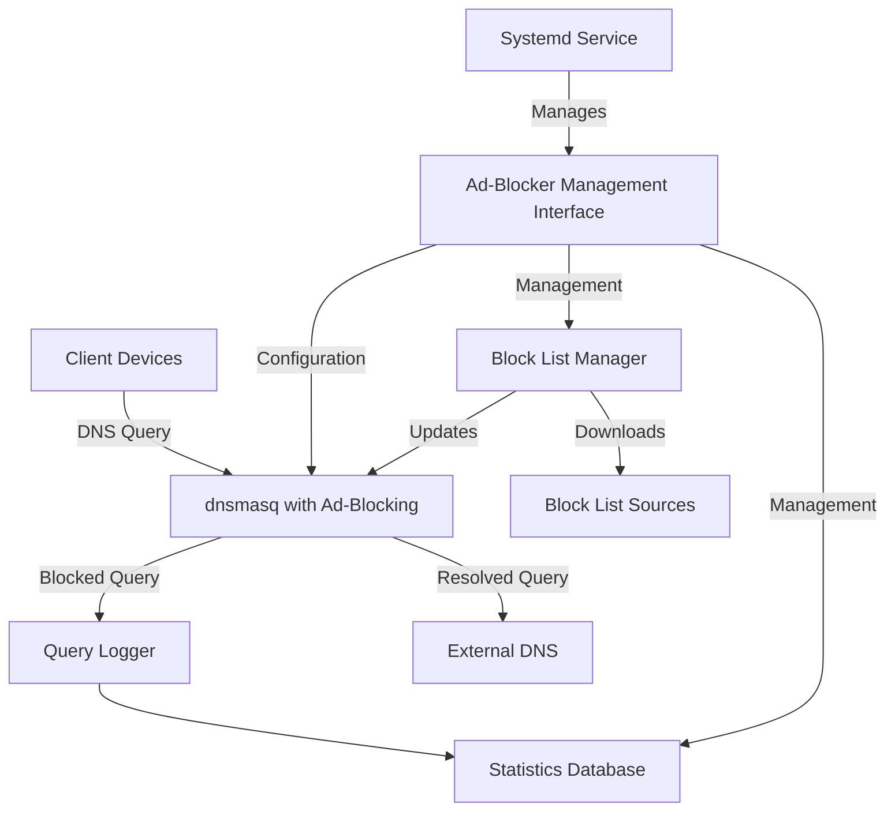
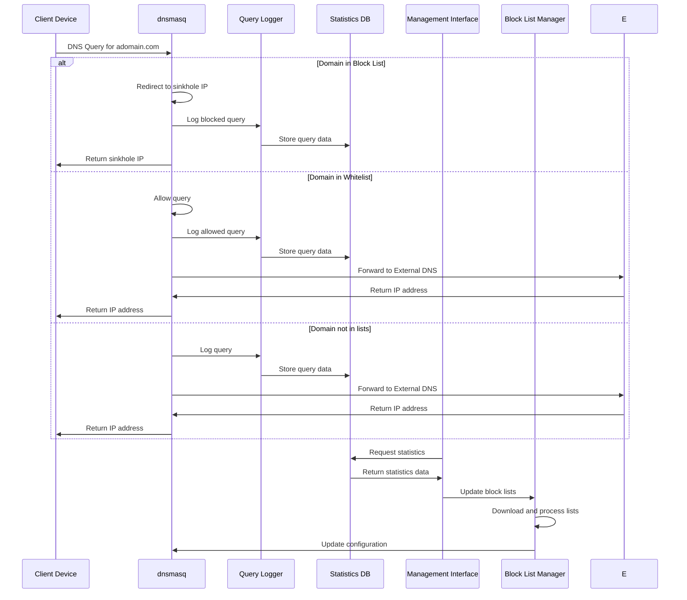
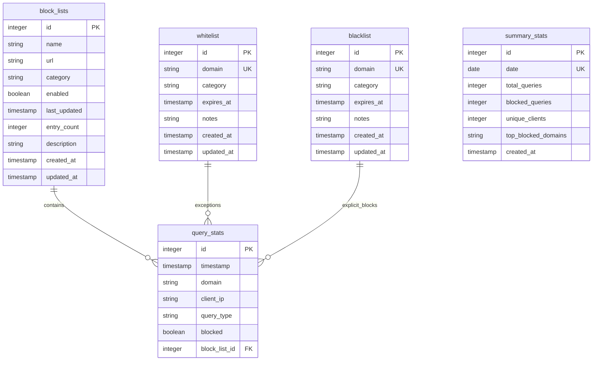
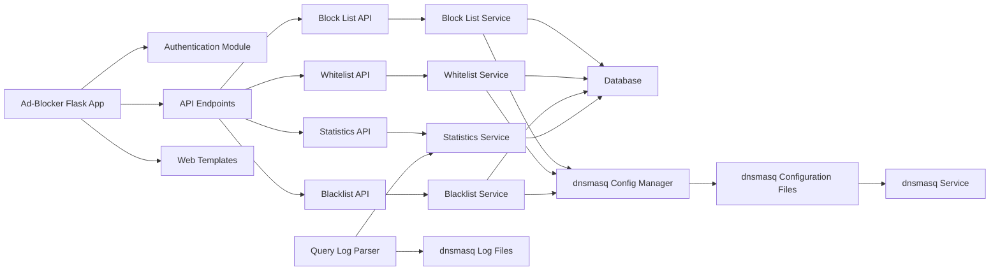
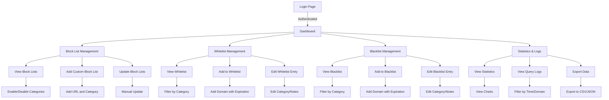
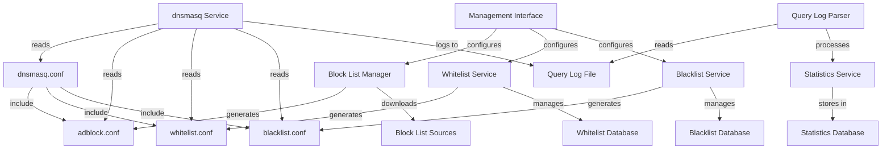
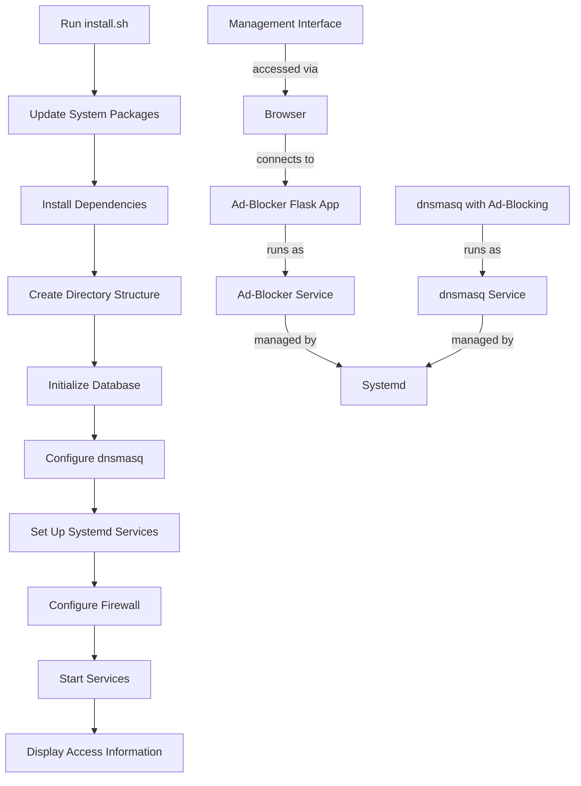
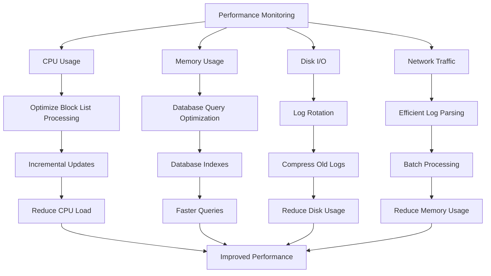

# PiDNS Ad-Blocker System Diagrams

## System Architecture Diagram

## Data Flow Diagram

## Database Schema Diagram

## Component Interaction Diagram

## User Interface Flow Diagram

## dnsmasq Integration Diagram

## Installation Process Diagram

## Performance Optimization Diagram

These diagrams provide a visual representation of the PiDNS Ad-Blocker system architecture, data flow, database schema, component interactions, user interface flow, dnsmasq integration, installation process, and performance optimization strategies.