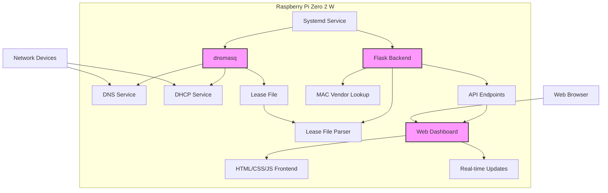

# PiDNS System Architecture

## System Overview

The PiDNS system will run on a Raspberry Pi Zero 2 W with Debian, providing both DNS and DHCP services for a local network, along with a web dashboard to monitor connected devices.

## Architecture Diagram

## Component Details

### 1. dnsmasq
- **Purpose**: Lightweight DNS forwarder and DHCP server
- **Why**: Perfect for resource-constrained devices like Pi Zero 2 W
- **Functionality**:
  - DNS caching and forwarding
  - DHCP lease management
  - Local DNS resolution
  - Lease file generation

### 2. Flask Backend
- **Purpose**: Web server and API for the dashboard
- **Why**: Lightweight, easy to implement, integrates well with Python
- **Functionality**:
  - REST API endpoints
  - Lease file parsing
  - MAC address vendor lookup
  - Device connection duration calculation
  - Authentication

### 3. Web Dashboard
- **Purpose**: User interface for monitoring connected devices
- **Technology**: HTML, CSS, JavaScript (vanilla, no heavy frameworks)
- **Functionality**:
  - Display connected devices
  - Show device information (IP, MAC, hostname, vendor, connection duration)
  - Real-time updates
  - Responsive design for various screen sizes

### 4. Systemd Service
- **Purpose**: Ensure services start on boot and restart if needed
- **Functionality**:
  - Auto-start dnsmasq on boot
  - Auto-start Flask dashboard on boot
  - Service monitoring and restart

## Data Flow

1. **DHCP Lease Process**:
   - Device connects to network
   - dnsmasq assigns IP address and records lease
   - Lease information written to lease file

2. **Dashboard Update Process**:
   - Flask backend periodically reads lease file
   - Parses lease information
   - Enriches data with MAC vendor lookup
   - Calculates connection duration
   - Serves data to dashboard via API

3. **User Interaction**:
   - User accesses dashboard via web browser
   - Dashboard requests data from Flask API
   - Dashboard displays device information
   - Dashboard updates in real-time

## Resource Optimization

Given the Pi Zero 2 W's constraints (512MB RAM, single-core CPU), the system is designed to be lightweight:

- dnsmasq: Minimal resource usage
- Flask: Lightweight web framework
- Vanilla JavaScript: No heavy frontend frameworks
- Efficient data parsing: Only read lease file when needed
- Minimal dependencies: Reduce installation size and memory usage

## Security Considerations

- Basic authentication for dashboard access
- Firewall configuration to restrict access
- Regular updates for security patches
- Secure configuration of dnsmasq