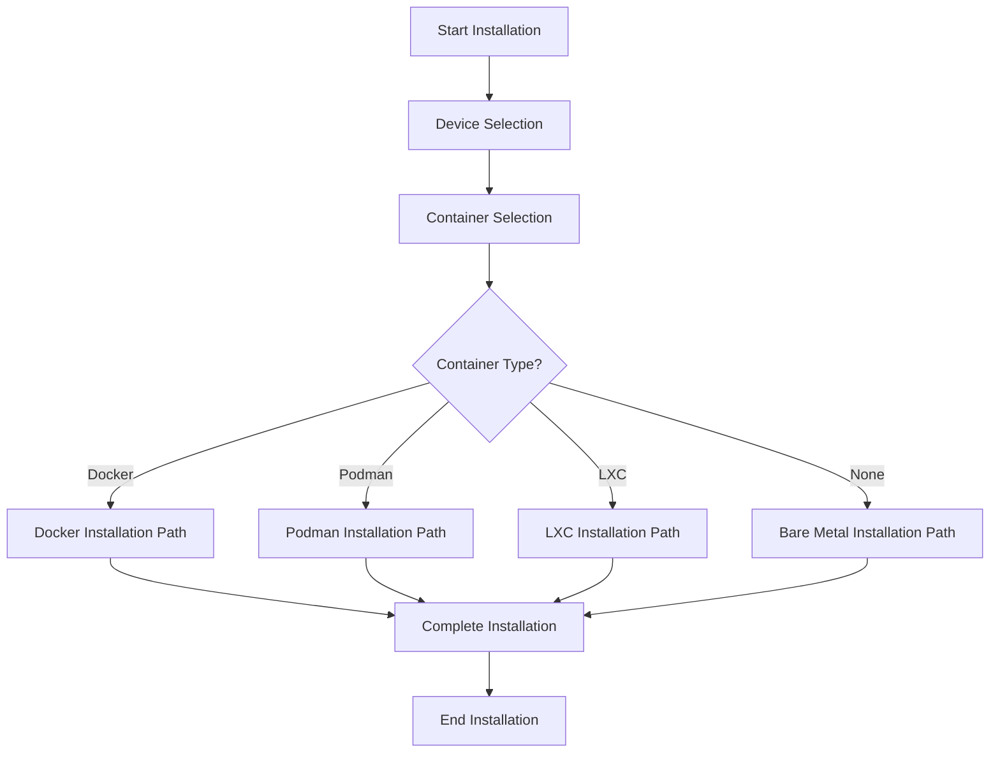
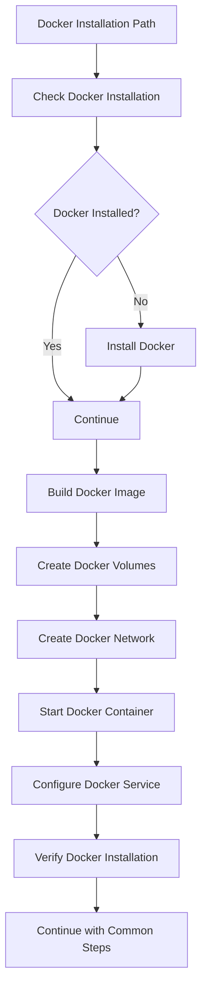
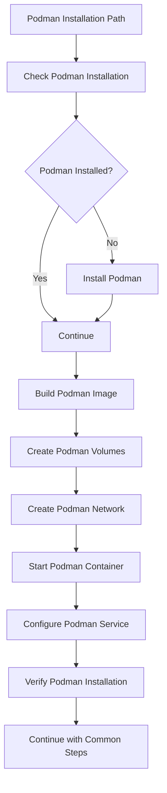
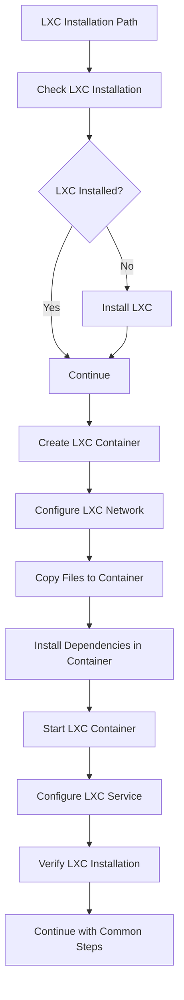

# PiDNS Container Installation Options Plan

## 1. Container Installation Flow Design

### Overall Installation Flow


### Container-Specific Installation Paths

#### Docker Installation Path


#### Podman Installation Path


#### LXC Installation Path


## 2. Container Installation Functions

### Docker Installation Functions

#### Docker Installation Function
```bash
# Function to install Docker
install_docker() {
    print_step "Installing Docker..."
    
    # Check if Docker is already installed
    if command -v docker &> /dev/null; then
        print_status "Docker is already installed."
        return 0
    fi
    
    # Install Docker
    curl -fsSL https://get.docker.com -o get-docker.sh
    sh get-docker.sh
    
    # Add user to docker group
    sudo usermod -aG docker $USER
    
    print_status "Docker installed successfully."
    print_warning "Please log out and log back in to use Docker without sudo."
    
    # Check if we need to wait for user to re-login
    if ! groups | grep -q docker; then
        print_warning "Current user is not in docker group yet."
        read -p "Press Enter after logging out and back in, or 'c' to continue: " continue_choice
        if [ "$continue_choice" != "c" ]; then
            exit 0
        fi
    fi
}

# Function to build Docker image
build_docker_image() {
    print_step "Building Docker image..."
    
    # Create Dockerfile if it doesn't exist
    if [ ! -f "Dockerfile" ]; then
        create_dockerfile
    fi
    
    # Build image with device type tag
    docker build -t pidns:$DEVICE_TYPE .
    
    print_status "Docker image built successfully."
}

# Function to create Dockerfile
create_dockerfile() {
    print_step "Creating Dockerfile..."
    
    cat > Dockerfile << EOF
# Multi-stage build for optimized image size
FROM python:3.11-slim as builder

# Install build dependencies
RUN apt-get update && apt-get install -y \\
    gcc \\
    && rm -rf /var/lib/apt/lists/*

# Install Python dependencies
COPY requirements.txt .
RUN pip install --user -r requirements.txt

COPY requirements_adblocker.txt .
RUN pip install --user -r requirements_adblocker.txt

# Final stage
FROM python:3.11-slim

# Install runtime dependencies
RUN apt-get update && apt-get install -y \\
    dnsmasq \\
    curl \\
    wget \\
    && rm -rf /var/lib/apt/lists/*

# Create app directory
WORKDIR /app

# Copy Python packages from builder
COPY --from=builder /root/.local /root/.local
ENV PATH=/root/.local/bin:\$PATH

# Copy application code
COPY . .

# Create non-root user
RUN useradd -m -u 1000 pidns && \\
    chown -R pidns:pidns /app
USER pidns

# Expose ports
EXPOSE 8080 8081 53 67/udp

# Health check
HEALTHCHECK --interval=30s --timeout=10s --start-period=5s --retries=3 \\
    CMD curl -f http://localhost:8080/api/health || exit 1

# Start command
CMD ["python3", "app/app.py"]
EOF

    print_status "Dockerfile created successfully."
}

# Function to create Docker volumes
create_docker_volumes() {
    print_step "Creating Docker volumes..."
    
    # Create named volumes
    docker volume create pidns-data
    docker volume create pidns-logs
    docker volume create pidns-config
    
    print_status "Docker volumes created successfully."
}

# Function to create Docker network
create_docker_network() {
    print_step "Creating Docker network..."
    
    # Create custom network for PiDNS
    docker network create --driver bridge pidns-net
    
    print_status "Docker network created successfully."
}

# Function to start Docker container
start_docker_container() {
    print_step "Starting Docker container..."
    
    # Stop and remove existing container if it exists
    if docker ps -a --format '{{.Names}}' | grep -q "^pidns$"; then
        docker stop pidns >/dev/null 2>&1 || true
        docker rm pidns >/dev/null 2>&1 || true
    fi
    
    # Start container with device-specific configuration
    docker run -d \\
        --name pidns \\
        --restart unless-stopped \\
        --network pidns-net \\
        --cap-add NET_ADMIN \\
        -v pidns-data:/app/data \\
        -v pidns-logs:/var/log/pidns \\
        -v pidns-config:/app/config \\
        -v /var/lib/misc:/var/lib/misc:rw \\
        -v /etc/dnsmasq.conf:/etc/dnsmasq.conf:rw \\
        -e FLASK_ENV=production \\
        -e PIDNS_USERNAME=admin \\
        -e PIDNS_PASSWORD=${PIDNS_PASSWORD:-password} \\
        -e DEVICE_TYPE=$DEVICE_TYPE \\
        pidns:$DEVICE_TYPE
    
    print_status "Docker container started successfully."
}

# Function to configure Docker service
configure_docker_service() {
    print_step "Configuring Docker service..."
    
    # Create systemd service file
    cat > /tmp/pidns-docker.service << EOF
[Unit]
Description=PiDNS Docker Container
After=docker.service network-online.target
Requires=docker.service network-online.target

[Service]
Type=oneshot
RemainAfterExit=yes
WorkingDirectory=$INSTALL_DIR
ExecStart=/usr/bin/docker-compose up -d
ExecStop=/usr/bin/docker-compose down
TimeoutStartSec=0
Restart=on-failure
RestartSec=10

[Install]
WantedBy=multi-user.target
EOF

    # Install service file
    sudo cp /tmp/pidns-docker.service /etc/systemd/system/
    
    # Create docker-compose.yml
    cat > docker-compose.yml << EOF
version: '3.8'

services:
  pidns:
    build: 
      context: .
      dockerfile: Dockerfile
    image: pidns:$DEVICE_TYPE
    container_name: pidns
    restart: unless-stopped
    network_mode: host
    cap_add:
      - NET_ADMIN
    volumes:
      - pidns-data:/app/data
      - pidns-logs:/var/log/pidns
      - pidns-config:/app/config
      - /var/lib/misc:/var/lib/misc:rw
      - /etc/dnsmasq.conf:/etc/dnsmasq.conf:rw
    environment:
      - FLASK_ENV=production
      - PIDNS_USERNAME=admin
      - PIDNS_PASSWORD=${PIDNS_PASSWORD:-password}
      - DEVICE_TYPE=$DEVICE_TYPE

volumes:
  pidns-data:
  pidns-logs:
  pidns-config:
EOF

    print_status "Docker service configured successfully."
}

# Function to verify Docker installation
verify_docker_installation() {
    print_step "Verifying Docker installation..."
    
    # Check if container is running
    if ! docker ps --format '{{.Names}}' | grep -q "^pidns$"; then
        print_error "Docker container is not running."
        return 1
    fi
    
    # Check if dashboard is accessible
    if ! docker exec pidns curl -s -f http://localhost:8080/api/health > /dev/null; then
        print_error "Main dashboard is not accessible in Docker container."
        return 1
    fi
    
    if ! docker exec pidns curl -s -f http://localhost:8081/api/health > /dev/null; then
        print_error "Ad-blocker dashboard is not accessible in Docker container."
        return 1
    fi
    
    print_status "Docker installation verified successfully."
    return 0
}
```

### Podman Installation Functions

#### Podman Installation Function
```bash
# Function to install Podman
install_podman() {
    print_step "Installing Podman..."
    
    # Check if Podman is already installed
    if command -v podman &> /dev/null; then
        print_status "Podman is already installed."
        return 0
    fi
    
    # Install Podman
    sudo apt-get update
    sudo apt-get install -y podman podman-compose
    
    print_status "Podman installed successfully."
}

# Function to build Podman image
build_podman_image() {
    print_step "Building Podman image..."
    
    # Create Containerfile if it doesn't exist
    if [ ! -f "Containerfile" ]; then
        create_containerfile
    fi
    
    # Build image with device type tag
    podman build -t pidns:$DEVICE_TYPE .
    
    print_status "Podman image built successfully."
}

# Function to create Containerfile
create_containerfile() {
    print_step "Creating Containerfile..."
    
    cat > Containerfile << EOF
# Podman Containerfile for PiDNS
FROM python:3.11-slim

# Install runtime dependencies
RUN apt-get update && apt-get install -y \\
    dnsmasq \\
    curl \\
    wget \\
    && rm -rf /var/lib/apt/lists/*

# Create app directory
WORKDIR /app

# Install Python dependencies
COPY requirements.txt .
RUN pip install --user -r requirements.txt

COPY requirements_adblocker.txt .
RUN pip install --user -r requirements_adblocker.txt

# Copy application code
COPY . .

# Create non-root user
RUN useradd -m -u 1000 pidns && \\
    chown -R pidns:pidns /app
USER pidns

# Expose ports
EXPOSE 8080 8081 53 67/udp

# Start command
CMD ["python3", "app/app.py"]
EOF

    print_status "Containerfile created successfully."
}

# Function to create Podman volumes
create_podman_volumes() {
    print_step "Creating Podman volumes..."
    
    # Create named volumes
    podman volume create pidns-data
    podman volume create pidns-logs
    podman volume create pidns-config
    
    print_status "Podman volumes created successfully."
}

# Function to create Podman network
create_podman_network() {
    print_step "Creating Podman network..."
    
    # Create custom network for PiDNS
    podman network create pidns-net
    
    print_status "Podman network created successfully."
}

# Function to start Podman container
start_podman_container() {
    print_step "Starting Podman container..."
    
    # Stop and remove existing container if it exists
    if podman ps -a --format '{{.Names}}' | grep -q "^pidns$"; then
        podman stop pidns >/dev/null 2>&1 || true
        podman rm pidns >/dev/null 2>&1 || true
    fi
    
    # Start container with device-specific configuration
    podman run -d \\
        --name pidns \\
        --restart unless-stopped \\
        --network pidns-net \\
        --cap-add NET_ADMIN \\
        -v pidns-data:/app/data \\
        -v pidns-logs:/var/log/pidns \\
        -v pidns-config:/app/config \\
        -v /var/lib/misc:/var/lib/misc:rw \\
        -v /etc/dnsmasq.conf:/etc/dnsmasq.conf:rw \\
        -e FLASK_ENV=production \\
        -e PIDNS_USERNAME=admin \\
        -e PIDNS_PASSWORD=${PIDNS_PASSWORD:-password} \\
        -e DEVICE_TYPE=$DEVICE_TYPE \\
        --userns keep-id \\
        pidns:$DEVICE_TYPE
    
    print_status "Podman container started successfully."
}

# Function to configure Podman service
configure_podman_service() {
    print_step "Configuring Podman service..."
    
    # Create systemd user service directory
    mkdir -p ~/.config/systemd/user
    
    # Create systemd service file
    cat > ~/.config/systemd/user/pidns.service << EOF
[Unit]
Description=PiDNS Podman Container
After=network-online.target
Requires=network-online.target

[Service]
Type=oneshot
RemainAfterExit=yes
WorkingDirectory=$INSTALL_DIR
ExecStart=/usr/bin/podman start pidns
ExecStop=/usr/bin/podman stop -t 10 pidns
ExecStopPost=/usr/bin/podman rm pidns
TimeoutStartSec=0
Restart=on-failure
RestartSec=10

[Install]
WantedBy=default.target
EOF

    # Create podman-compose.yml
    cat > podman-compose.yml << EOF
version: '3.8'

services:
  pidns:
    build: 
      context: .
      dockerfile: Containerfile
    image: pidns:$DEVICE_TYPE
    container_name: pidns
    restart: unless-stopped
    network_mode: host
    cap_add:
      - NET_ADMIN
    volumes:
      - pidns-data:/app/data
      - pidns-logs:/var/log/pidns
      - pidns-config:/app/config
      - /var/lib/misc:/var/lib/misc:rw
      - /etc/dnsmasq.conf:/etc/dnsmasq.conf:rw
    environment:
      - FLASK_ENV=production
      - PIDNS_USERNAME=admin
      - PIDNS_PASSWORD=${PIDNS_PASSWORD:-password}
      - DEVICE_TYPE=$DEVICE_TYPE
    userns: keep-id

volumes:
  pidns-data:
  pidns-logs:
  pidns-config:
EOF

    # Enable lingering for user
    sudo loginctl enable-linger $USER
    
    # Reload systemd user services
    systemctl --user daemon-reload
    
    print_status "Podman service configured successfully."
}

# Function to verify Podman installation
verify_podman_installation() {
    print_step "Verifying Podman installation..."
    
    # Check if container is running
    if ! podman ps --format '{{.Names}}' | grep -q "^pidns$"; then
        print_error "Podman container is not running."
        return 1
    fi
    
    # Check if dashboard is accessible
    if ! podman exec pidns curl -s -f http://localhost:8080/api/health > /dev/null; then
        print_error "Main dashboard is not accessible in Podman container."
        return 1
    fi
    
    if ! podman exec pidns curl -s -f http://localhost:8081/api/health > /dev/null; then
        print_error "Ad-blocker dashboard is not accessible in Podman container."
        return 1
    fi
    
    print_status "Podman installation verified successfully."
    return 0
}
```

### LXC Installation Functions

#### LXC Installation Function
```bash
# Function to install LXC
install_lxc() {
    print_step "Installing LXC..."
    
    # Check if LXC is already installed
    if command -v lxc-create &> /dev/null; then
        print_status "LXC is already installed."
        return 0
    fi
    
    # Install LXC
    sudo apt-get update
    sudo apt-get install -y lxc lxc-templates debootstrap
    
    print_status "LXC installed successfully."
}

# Function to create LXC container
create_lxc_container() {
    print_step "Creating LXC container..."
    
    # Stop and remove existing container if it exists
    if lxc-info -n pidns >/dev/null 2>&1; then
        lxc-stop -n pidns >/dev/null 2>&1 || true
        lxc-destroy -n pidns >/dev/null 2>&1 || true
    fi
    
    # Create container
    lxc-create -n pidns -t download -- -d debian -r bullseye -a armhf
    
    print_status "LXC container created successfully."
}

# Function to configure LXC network
configure_lxc_network() {
    print_step "Configuring LXC network..."
    
    # Create network bridge if it doesn't exist
    if ! ip link show lxcbr0 >/dev/null 2>&1; then
        sudo brctl addbr lxcbr0
        sudo ip addr add 192.168.100.1/24 dev lxcbr0
        sudo ip link set lxcbr0 up
        
        # Configure NAT
        sudo iptables -t nat -A POSTROUTING -o eth0 -j MASQUERADE
        sudo iptables -A FORWARD -i lxcbr0 -j ACCEPT
        sudo iptables -A FORWARD -o lxcbr0 -m state --state RELATED,ESTABLISHED -j ACCEPT
    fi
    
    # Configure container network
    cat > /tmp/lxc-network.conf << EOF
lxc.net.0.type = veth
lxc.net.0.link = lxcbr0
lxc.net.0.flags = up
lxc.net.0.hwaddr = 00:16:3e:xx:xx:xx
EOF
    
    lxc-config -n pidns -s lxc.net.0.type -v veth
    lxc-config -n pidns -s lxc.net.0.link -v lxcbr0
    lxc-config -n pidns -s lxc.net.0.flags -v up
    
    print_status "LXC network configured successfully."
}

# Function to copy files to LXC container
copy_files_to_lxc_container() {
    print_step "Copying files to LXC container..."
    
    # Start container
    lxc-start -n pidns -d
    
    # Wait for container to start
    sleep 10
    
    # Create app directory in container
    lxc-attach -n pidns -- mkdir -p /app
    
    # Copy files to container
    tar -cf - . | lxc-attach -n pidns -- tar -xf - -C /app
    
    print_status "Files copied to LXC container successfully."
}

# Function to install dependencies in LXC container
install_lxc_dependencies() {
    print_step "Installing dependencies in LXC container..."
    
    # Install system dependencies
    lxc-attach -n pidns -- apt-get update
    lxc-attach -n pidns -- apt-get install -y python3 python3-pip dnsmasq curl wget
    
    # Install Python dependencies
    lxc-attach -n pidns -- pip3 install -r /app/requirements.txt
    lxc-attach -n pidns -- pip3 install -r /app/requirements_adblocker.txt
    
    print_status "Dependencies installed in LXC container successfully."
}

# Function to start LXC container
start_lxc_container() {
    print_step "Starting LXC container..."
    
    # Configure dnsmasq based on device type
    lxc-attach -n pidns -- cp /app/config/dnsmasq.$DEVICE_TYPE.conf /etc/dnsmasq.conf
    
    # Create startup script
    cat > /tmp/start-pidns.sh << 'EOF'
#!/bin/bash
cd /app
python3 app/app.py &
dnsmasq
EOF
    
    lxc-file-push /tmp/start-pidns.sh pidns/usr/local/bin/start-pidns.sh
    lxc-attach -n pidns -- chmod +x /usr/local/bin/start-pidns.sh
    
    # Configure autostart
    lxc-config -n pidns -s lxc.start.auto -v 1
    lxc-config -n pidns -s lxc.start.delay -v 5
    
    # Set resource limits based on device type
    case $DEVICE_TYPE in
        "pi-zero"|"pi-zero-2w")
            lxc-config -n pidns -s lxc.cgroup.memory.limit_in_bytes -v 512M
            lxc-config -n pidns -s lxc.cgroup.memory.swappiness -v 10
            lxc-config -n pidns -s lxc.cgroup.cpu.shares -v 128
            ;;
        "pi-3")
            lxc-config -n pidns -s lxc.cgroup.memory.limit_in_bytes -v 1024M
            lxc-config -n pidns -s lxc.cgroup.memory.swappiness -v 10
            lxc-config -n pidns -s lxc.cgroup.cpu.shares -v 256
            ;;
        "pi-4"|"pi-5")
            lxc-config -n pidns -s lxc.cgroup.memory.limit_in_bytes -v 2048M
            lxc-config -n pidns -s lxc.cgroup.memory.swappiness -v 5
            lxc-config -n pidns -s lxc.cgroup.cpu.shares -v 512
            ;;
        "low-resource-pc")
            lxc-config -n pidns -s lxc.cgroup.memory.limit_in_bytes -v 1024M
            lxc-config -n pidns -s lxc.cgroup.memory.swappiness -v 10
            lxc-config -n pidns -s lxc.cgroup.cpu.shares -v 256
            ;;
        "standard-pc")
            lxc-config -n pidns -s lxc.cgroup.memory.limit_in_bytes -v 2048M
            lxc-config -n pidns -s lxc.cgroup.memory.swappiness -v 5
            lxc-config -n pidns -s lxc.cgroup.cpu.shares -v 512
            ;;
    esac
    
    # Start services
    lxc-attach -n pidns -- /usr/local/bin/start-pidns.sh
    
    print_status "LXC container started successfully."
}

# Function to configure LXC service
configure_lxc_service() {
    print_step "Configuring LXC service..."
    
    # Create systemd service file
    cat > /tmp/pidns-lxc.service << EOF
[Unit]
Description=PiDNS LXC Container
After=lxc.service network-online.target
Requires=lxc.service network-online.target

[Service]
Type=oneshot
RemainAfterExit=yes
WorkingDirectory=$INSTALL_DIR
ExecStart=/usr/bin/lxc-start -n pidns -d
ExecStop=/usr/bin/lxc-stop -n pidns
TimeoutStartSec=0
Restart=on-failure
RestartSec=10

[Install]
WantedBy=multi-user.target
EOF

    # Install service file
    sudo cp /tmp/pidns-lxc.service /etc/systemd/system/
    
    print_status "LXC service configured successfully."
}

# Function to verify LXC installation
verify_lxc_installation() {
    print_step "Verifying LXC installation..."
    
    # Check if container is running
    if ! lxc-info -n pidns -s | grep -q "RUNNING"; then
        print_error "LXC container is not running."
        return 1
    fi
    
    # Get container IP
    CONTAINER_IP=$(lxc-info -n pidns -iH)
    
    # Check if dashboard is accessible
    if ! curl -s -f http://$CONTAINER_IP:8080/api/health > /dev/null; then
        print_error "Main dashboard is not accessible in LXC container."
        return 1
    fi
    
    if ! curl -s -f http://$CONTAINER_IP:8081/api/health > /dev/null; then
        print_error "Ad-blocker dashboard is not accessible in LXC container."
        return 1
    fi
    
    print_status "LXC installation verified successfully."
    return 0
}
```

## 3. Container Installation Integration

### Container Installation Selection Function
```bash
# Function to handle container installation
install_container() {
    case $CONTAINER_TYPE in
        "docker")
            install_docker
            build_docker_image
            create_docker_volumes
            create_docker_network
            start_docker_container
            configure_docker_service
            verify_docker_installation
            ;;
        "podman")
            install_podman
            build_podman_image
            create_podman_volumes
            create_podman_network
            start_podman_container
            configure_podman_service
            verify_podman_installation
            ;;
        "lxc")
            install_lxc
            create_lxc_container
            configure_lxc_network
            copy_files_to_lxc_container
            install_lxc_dependencies
            start_lxc_container
            configure_lxc_service
            verify_lxc_installation
            ;;
        *)
            print_error "Unknown container type: $CONTAINER_TYPE"
            return 1
            ;;
    esac
}
```

### Container Installation Integration in Main Script
```bash
# Modified main function to include container installation
main() {
    # Display header
    display_header
    
    # Check if running as root
    check_root
    
    # Prompt for device selection
    prompt_device_selection
    
    # Prompt for container selection
    prompt_container_selection
    
    # Get device-specific configuration
    get_device_config
    
    # Update system packages
    update_system_packages
    
    # Install container dependencies
    install_container_dependencies
    
    # Install required packages
    install_required_packages
    
    # Create installation directory
    create_installation_directory
    
    # Create Python virtual environment
    create_python_venv
    
    # Install Python dependencies
    install_python_dependencies
    
    # Download MAC vendor database
    download_mac_vendor_database
    
    # Handle container or bare metal installation
    if [ "$CONTAINER_TYPE" != "none" ]; then
        # Container installation
        install_container
    else
        # Bare metal installation
        configure_dnsmasq
        install_systemd_services
        start_services
    fi
    
    # Configure firewall
    configure_firewall
    
    # Set up log rotation
    setup_log_rotation
    
    # Create ad-blocker data directories
    create_adblocker_directories
    
    # Apply performance optimizations
    apply_performance_optimizations
    
    # Create startup script
    create_startup_script
    
    # Print installation summary
    print_installation_summary
}
```

## 4. Container-Specific Configuration Files

### Docker Configuration Files

#### Docker Compose Override Files
```yaml
# docker-compose.override.pi-zero.yml
version: '3.8'

services:
  pidns:
    environment:
      - FLASK_ENV=production
      - PIDNS_USERNAME=admin
      - PIDNS_PASSWORD=${PIDNS_PASSWORD:-password}
      - DEVICE_TYPE=pi-zero
    deploy:
      resources:
        limits:
          memory: 512M
          cpus: '1.0'
        reservations:
          memory: 256M
          cpus: '0.5'
```

```yaml
# docker-compose.override.pi-3.yml
version: '3.8'

services:
  pidns:
    environment:
      - FLASK_ENV=production
      - PIDNS_USERNAME=admin
      - PIDNS_PASSWORD=${PIDNS_PASSWORD:-password}
      - DEVICE_TYPE=pi-3
    deploy:
      resources:
        limits:
          memory: 1G
          cpus: '2.0'
        reservations:
          memory: 512M
          cpus: '1.0'
```

```yaml
# docker-compose.override.pi-4-5.yml
version: '3.8'

services:
  pidns:
    environment:
      - FLASK_ENV=production
      - PIDNS_USERNAME=admin
      - PIDNS_PASSWORD=${PIDNS_PASSWORD:-password}
      - DEVICE_TYPE=pi-4
    deploy:
      resources:
        limits:
          memory: 2G
          cpus: '4.0'
        reservations:
          memory: 1G
          cpus: '2.0'
```

### Podman Configuration Files

#### Podman Quadlet Files
```ini
# pidns-docker.container
[Unit]
Description=PiDNS Docker Container
After=network-online.target

[Container]
Image=localhost/pidns:pi-zero
ContainerName=pidns
Network=host
Volume=pidns-data:/app/data:z
Volume=pidns-logs:/var/log/pidns:z
Volume=pidns-config:/app/config:z
Environment=FLASK_ENV=production
Environment=PIDNS_USERNAME=admin
Environment=PIDNS_PASSWORD=password
Environment=DEVICE_TYPE=pi-zero

[Service]
Restart=always

[Install]
WantedBy=default.target
```

### LXC Configuration Files

#### LXC Configuration Files
```conf
# lxc-pi-zero.conf
lxc.uts.name = pidns
lxc.arch = linuxarm

# Network configuration
lxc.net.0.type = veth
lxc.net.0.link = lxcbr0
lxc.net.0.flags = up
lxc.net.0.hwaddr = 00:16:3e:xx:xx:xx

# Root filesystem
lxc.rootfs.path = dir:/var/lib/lxc/pidns/rootfs

# Mounts
lxc.mount.entry = /var/lib/misc var/lib/misc none bind,create=dir
lxc.mount.entry = /etc/dnsmasq.conf etc/dnsmasq.conf none bind,create=file

# Autostart
lxc.start.auto = 1
lxc.start.delay = 5

# Resource limits for Pi Zero
lxc.cgroup.memory.limit_in_bytes = 512M
lxc.cgroup.memory.swappiness = 10
lxc.cgroup.cpu.shares = 128

# Capabilities
lxc.cap.drop = sys_admin sys_module sys_rawio
```

## 5. Container Installation Testing

### Container Installation Test Plan
```bash
# Function to test container installation
test_container_installation() {
    print_step "Testing container installation..."
    
    local test_passed=true
    
    # Test container is running
    case $CONTAINER_TYPE in
        "docker")
                if ! docker ps --format '{{.Names}}' | grep -q "^pidns$"; then
                    print_error "Docker container is not running."
                    test_passed=false
                fi
                ;;
        "podman")
                if ! podman ps --format '{{.Names}}' | grep -q "^pidns$"; then
                    print_error "Podman container is not running."
                    test_passed=false
                fi
                ;;
        "lxc")
                if ! lxc-info -n pidns -s | grep -q "RUNNING"; then
                    print_error "LXC container is not running."
                    test_passed=false
                fi
                ;;
    esac
    
    # Test dashboard accessibility
    case $CONTAINER_TYPE in
        "docker"|"podman")
                if ! curl -s -f http://localhost:8080/api/health > /dev/null; then
                    print_error "Main dashboard is not accessible."
                    test_passed=false
                fi
                
                if ! curl -s -f http://localhost:8081/api/health > /dev/null; then
                    print_error "Ad-blocker dashboard is not accessible."
                    test_passed=false
                fi
                ;;
        "lxc")
                CONTAINER_IP=$(lxc-info -n pidns -iH)
                
                if ! curl -s -f http://$CONTAINER_IP:8080/api/health > /dev/null; then
                    print_error "Main dashboard is not accessible."
                    test_passed=false
                fi
                
                if ! curl -s -f http://$CONTAINER_IP:8081/api/health > /dev/null; then
                    print_error "Ad-blocker dashboard is not accessible."
                    test_passed=false
                fi
                ;;
    esac
    
    # Test DNS functionality
    if ! nslookup example.com localhost >/dev/null 2>&1; then
        print_error "DNS functionality is not working."
        test_passed=false
    fi
    
    # Print test result
    if [ "$test_passed" = true ]; then
        print_status "Container installation tests passed."
        return 0
    else
        print_error "Container installation tests failed."
        return 1
    fi
}
```

## 6. Container Installation Error Handling

### Container Installation Error Handling
```bash
# Function to handle container installation errors
handle_container_installation_error() {
    local exit_code=$?
    local line_number=$1
    print_error "Container installation failed at line $line_number with exit code $exit_code"
    
    # Offer to clean up container installation
    echo
    read -p "Do you want to clean up the container installation? (y/n): " cleanup_choice
    if [ "$cleanup_choice" = "y" ]; then
        cleanup_container_installation
    fi
    
    exit $exit_code
}

# Function to clean up container installation
cleanup_container_installation() {
    print_status "Cleaning up container installation..."
    
    case $CONTAINER_TYPE in
        "docker")
                # Stop and remove container
                docker stop pidns >/dev/null 2>&1 || true
                docker rm pidns >/dev/null 2>&1 || true
                
                # Remove image
                docker rmi pidns:$DEVICE_TYPE >/dev/null 2>&1 || true
                
                # Remove volumes
                docker volume rm pidns-data >/dev/null 2>&1 || true
                docker volume rm pidns-logs >/dev/null 2>&1 || true
                docker volume rm pidns-config >/dev/null 2>&1 || true
                
                # Remove network
                docker network rm pidns-net >/dev/null 2>&1 || true
                
                # Remove service file
                sudo rm -f /etc/systemd/system/pidns-docker.service
                sudo systemctl daemon-reload
                ;;
        "podman")
                # Stop and remove container
                podman stop pidns >/dev/null 2>&1 || true
                podman rm pidns >/dev/null 2>&1 || true
                
                # Remove image
                podman rmi pidns:$DEVICE_TYPE >/dev/null 2>&1 || true
                
                # Remove volumes
                podman volume rm pidns-data >/dev/null 2>&1 || true
                podman volume rm pidns-logs >/dev/null 2>&1 || true
                podman volume rm pidns-config >/dev/null 2>&1 || true
                
                # Remove network
                podman network rm pidns-net >/dev/null 2>&1 || true
                
                # Remove service file
                rm -f ~/.config/systemd/user/pidns.service
                systemctl --user daemon-reload
                ;;
        "lxc")
                # Stop and destroy container
                lxc-stop -n pidns >/dev/null 2>&1 || true
                lxc-destroy -n pidns >/dev/null 2>&1 || true
                
                # Remove service file
                sudo rm -f /etc/systemd/system/pidns-lxc.service
                sudo systemctl daemon-reload
                ;;
    esac
    
    print_status "Container installation cleanup completed."
}
```

## 7. Container Installation Documentation

### Container Installation Documentation
```markdown
# PiDNS Container Installation Guide

## Supported Container Types

PiDNS supports installation in the following container types:

1. **Docker**: Most popular container platform with wide community support
2. **Podman**: Daemonless, rootless containers with better security
3. **LXC**: Lightweight OS-level virtualization with better performance

## Prerequisites

### Docker Prerequisites
- A 64-bit Linux distribution
- Docker installed (installation script will install if not present)
- User in docker group (installation script will configure if needed)

### Podman Prerequisites
- A 64-bit Linux distribution
- Podman installed (installation script will install if not present)
- systemd user services enabled (installation script will configure if needed)

### LXC Prerequisites
- A 64-bit Linux distribution
- LXC installed (installation script will install if not present)
- Network bridge configured (installation script will configure if needed)

## Installation Steps

### Interactive Installation

1. Run the installation script:
   ```bash
   chmod +x scripts/install.sh
   ./scripts/install.sh
   ```

2. Select your device type when prompted:
   ```
   Please select your target device:
   1) Raspberry Pi Zero W
   2) Raspberry Pi Zero 2 W
   3) Raspberry Pi 3
   4) Raspberry Pi 4
   5) Raspberry Pi 5
   6) Low-resource PC (≤1GB RAM, ≤2 cores)
   7) Standard PC (>1GB RAM, >2 cores)
   8) Auto-detect (recommended)
   Enter your choice (1-8): 
   ```

3. Choose to run in a container when prompted:
   ```
   Do you want to run PiDNS in a container? (y/n) y
   ```

4. Select your container type when prompted:
   ```
   Please select container type:
   1) Docker
   2) Podman
   3) LXC
   Enter your choice (1-3): 
   ```

5. Follow the installation progress and wait for completion.

### Silent Installation

For automated installations, you can use command line arguments:

```bash
./scripts/install.sh --device pi-4 --container docker --silent
```

Available options:
- `--device DEVICE_TYPE`: Specify device type (pi-zero, pi-zero-2w, pi-3, pi-4, pi-5, low-resource-pc, standard-pc)
- `--container CONTAINER_TYPE`: Specify container type (docker, podman, lxc, none)
- `--silent`: Run in silent mode with no interactive prompts

## Post-Installation

### Accessing the Dashboard

After installation, you can access the PiDNS dashboards at:

- **Main Dashboard**: `http://<container-ip>:8080`
- **Ad-Blocker Dashboard**: `http://<container-ip>:8081`

Default credentials:
- Username: `admin`
- Password: `password`

**Important**: Change the default password immediately after installation!

### Container Management

#### Docker Management
```bash
# View container status
docker ps

# View container logs
docker logs pidns

# Stop container
docker stop pidns

# Start container
docker start pidns

# Restart container
docker restart pidns

# Remove container
docker stop pidns && docker rm pidns
```

#### Podman Management
```bash
# View container status
podman ps

# View container logs
podman logs pidns

# Stop container
podman stop pidns

# Start container
podman start pidns

# Restart container
podman restart pidns

# Remove container
podman stop pidns && podman rm pidns
```

#### LXC Management
```bash
# View container status
lxc-info -n pidns

# View container logs
lxc-attach -n pidns -- tail -f /var/log/pidns.log

# Stop container
lxc-stop -n pidns

# Start container
lxc-start -n pidns -d

# Restart container
lxc-stop -n pidns && lxc-start -n pidns -d

# Remove container
lxc-stop -n pidns && lxc-destroy -n pidns
```

### Configuration Management

#### Docker Configuration
```bash
# Edit configuration files
docker exec -it pidns nano /app/config/flask_config.py

# Restart container after configuration changes
docker restart pidns
```

#### Podman Configuration
```bash
# Edit configuration files
podman exec -it pidns nano /app/config/flask_config.py

# Restart container after configuration changes
podman restart pidns
```

#### LXC Configuration
```bash
# Edit configuration files
lxc-attach -n pidns -- nano /app/config/flask_config.py

# Restart container after configuration changes
lxc-stop -n pidns && lxc-start -n pidns -d
```

### Data Persistence

#### Docker Data Persistence
Docker volumes are used for data persistence:
- `pidns-data`: Application data
- `pidns-logs`: Log files
- `pidns-config`: Configuration files

To backup data:
```bash
# Create backup directory
mkdir -p ~/pidns-backup

# Backup volumes
docker run --rm -v pidns-data:/data -v ~/pidns-backup:/backup alpine tar czf /backup/data-backup.tar.gz -C /data .
docker run --rm -v pidns-logs:/logs -v ~/pidns-backup:/backup alpine tar czf /backup/logs-backup.tar.gz -C /logs .
docker run --rm -v pidns-config:/config -v ~/pidns-backup:/backup alpine tar czf /backup/config-backup.tar.gz -C /config .
```

#### Podman Data Persistence
Podman volumes are used for data persistence:
- `pidns-data`: Application data
- `pidns-logs`: Log files
- `pidns-config`: Configuration files

To backup data:
```bash
# Create backup directory
mkdir -p ~/pidns-backup

# Backup volumes
podman run --rm -v pidns-data:/data -v ~/pidns-backup:/backup alpine tar czf /backup/data-backup.tar.gz -C /data .
podman run --rm -v pidns-logs:/logs -v ~/pidns-backup:/backup alpine tar czf /backup/logs-backup.tar.gz -C /logs .
podman run --rm -v pidns-config:/config -v ~/pidns-backup:/backup alpine tar czf /backup/config-backup.tar.gz -C /config .
```

#### LXC Data Persistence
LXC container filesystem is used for data persistence:
- `/app/data`: Application data
- `/var/log/pidns`: Log files
- `/app/config`: Configuration files

To backup data:
```bash
# Create backup directory
mkdir -p ~/pidns-backup

# Backup data
lxc-attach -n pidns -- tar czf /tmp/data-backup.tar.gz -C /app/data .
lxc-file-pull pidns/tmp/data-backup.tar.gz ~/pidns-backup/

# Backup logs
lxc-attach -n pidns -- tar czf /tmp/logs-backup.tar.gz -C /var/log/pidns .
lxc-file-pull pidns/tmp/logs-backup.tar.gz ~/pidns-backup/

# Backup config
lxc-attach -n pidns -- tar czf /tmp/config-backup.tar.gz -C /app/config .
lxc-file-pull pidns/tmp/config-backup.tar.gz ~/pidns-backup/
```

## Troubleshooting

### Container Not Starting

#### Docker Troubleshooting
```bash
# Check container status
docker ps -a

# View container logs
docker logs pidns

# Check Docker daemon status
sudo systemctl status docker

# Restart Docker daemon
sudo systemctl restart docker
```

#### Podman Troubleshooting
```bash
# Check container status
podman ps -a

# View container logs
podman logs pidns

# Check Podman service status
systemctl --user status podman

# Restart Podman service
systemctl --user restart podman
```

#### LXC Troubleshooting
```bash
# Check container status
lxc-info -n pidns

# View container logs
lxc-attach -n pidns -- journalctl -u pidns

# Check LXC service status
sudo systemctl status lxc

# Restart LXC service
sudo systemctl restart lxc
```

### Dashboard Not Accessible

#### Docker Dashboard Troubleshooting
```bash
# Check if container is running
docker ps | grep pidns

# Check if ports are exposed
docker port pidns

# Check if dashboard is accessible inside container
docker exec pidns curl -f http://localhost:8080/api/health

# Check container logs for errors
docker logs pidns
```

#### Podman Dashboard Troubleshooting
```bash
# Check if container is running
podman ps | grep pidns

# Check if ports are exposed
podman port pidns

# Check if dashboard is accessible inside container
podman exec pidns curl -f http://localhost:8080/api/health

# Check container logs for errors
podman logs pidns
```

#### LXC Dashboard Troubleshooting
```bash
# Check if container is running
lxc-info -n pidns

# Get container IP
CONTAINER_IP=$(lxc-info -n pidns -iH)

# Check if dashboard is accessible inside container
lxc-attach -n pidns -- curl -f http://localhost:8080/api/health

# Check container logs for errors
lxc-attach -n pidns -- journalctl -u pidns
```

### DNS Not Working

#### Docker DNS Troubleshooting
```bash
# Check if dnsmasq is running in container
docker exec pidns systemctl status dnsmasq

# Check dnsmasq configuration
docker exec pidns cat /etc/dnsmasq.conf

# Test DNS resolution inside container
docker exec pidns nslookup example.com localhost

# Check container logs for DNS errors
docker logs pidns | grep -i dns
```

#### Podman DNS Troubleshooting
```bash
# Check if dnsmasq is running in container
podman exec pidns systemctl status dnsmasq

# Check dnsmasq configuration
podman exec pidns cat /etc/dnsmasq.conf

# Test DNS resolution inside container
podman exec pidns nslookup example.com localhost

# Check container logs for DNS errors
podman logs pidns | grep -i dns
```

#### LXC DNS Troubleshooting
```bash
# Check if dnsmasq is running in container
lxc-attach -n pidns -- systemctl status dnsmasq

# Check dnsmasq configuration
lxc-attach -n pidns -- cat /etc/dnsmasq.conf

# Test DNS resolution inside container
lxc-attach -n pidns -- nslookup example.com localhost

# Check container logs for DNS errors
lxc-attach -n pidns -- journalctl -u dnsmasq
```

## Performance Considerations

### Docker Performance
- Use resource limits to prevent container from using too much host resources
- Consider using Docker volumes for better I/O performance
- Use health checks to ensure container is running properly

### Podman Performance
- Podman has similar performance characteristics to Docker
- Rootless containers may have slightly higher overhead
- Use systemd user services for better integration with host system

### LXC Performance
- LXC containers have the lowest overhead among the three options
- OS-level virtualization provides near-native performance
- Consider using resource limits to prevent container from using too much host resources

## Security Considerations

### Docker Security
- Run containers as non-root users when possible
- Use read-only filesystems where appropriate
- Limit container capabilities to only what's needed
- Use seccomp profiles to restrict system calls

### Podman Security
- Rootless containers provide better security by default
- Use SELinux/AppArmor labeling for better isolation
- Limit container capabilities to only what's needed
- Use user namespaces for better user isolation

### LXC Security
- Use AppArmor profiles for better isolation
- Drop unnecessary capabilities
- Use resource limits to prevent denial of service
- Consider using unprivileged containers when possible