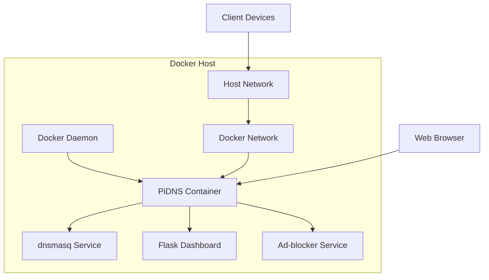
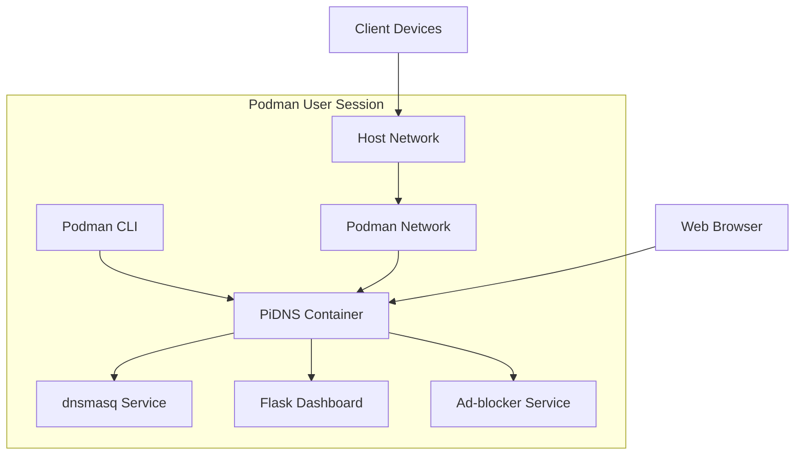

# PiDNS Container Support Plan

## 1. Container Technology Comparison

### Docker
**Pros:**
- Widely adopted with extensive community support
- Rich ecosystem of tools and documentation
- Easy to use and well-documented
- Cross-platform compatibility

**Cons:**
- Requires Docker daemon (runs as root)
- Higher resource overhead compared to alternatives
- Security concerns with daemon running as root

### Podman
**Pros:**
- Daemonless architecture
- Rootless containers by default
- Better security profile
- CLI-compatible with Docker

**Cons:**
- Smaller community compared to Docker
- Less mature ecosystem
- Some advanced features may be missing

### LXC
**Pros:**
- Lightweight OS-level virtualization
- Better performance for system-level services
- Lower resource overhead
- More traditional Linux container approach

**Cons:**
- Steeper learning curve
- Less portable across different systems
- More complex setup for networking

## 2. Container Architecture Design

### Docker Container Architecture


### Podman Container Architecture


### LXC Container Architecture


## 3. Container Configuration Files

### Docker Configuration

#### Dockerfile
```dockerfile
# Base image selection based on target architecture
FROM --platform=linux/arm/v7 python:3.11-slim-bullseye as base

# Install system dependencies
RUN apt-get update && apt-get install -y \
    dnsmasq \
    nginx \
    curl \
    wget \
    supervisor \
    && rm -rf /var/lib/apt/lists/*

# Create app directory
WORKDIR /app

# Install Python dependencies
COPY requirements.txt .
RUN pip install --no-cache-dir -r requirements.txt

COPY requirements_adblocker.txt .
RUN pip install --no-cache-dir -r requirements_adblocker.txt

# Copy application code
COPY . .

# Create non-root user
RUN useradd -m -u 1000 pidns && \
    chown -R pidns:pidns /app
USER pidns

# Expose ports
EXPOSE 8080 8081 53 67/udp

# Health check
HEALTHCHECK --interval=30s --timeout=10s --start-period=5s --retries=3 \
    CMD curl -f http://localhost:8080/api/health || exit 1

# Start command
CMD ["python3", "app/app.py"]
```

#### docker-compose.yml
```yaml
version: '3.8'

services:
  pidns:
    build: .
    container_name: pidns
    restart: unless-stopped
    network_mode: host
    cap_add:
      - NET_ADMIN
    volumes:
      - ./config:/app/config:ro
      - ./data:/app/data
      - /var/lib/misc:/var/lib/misc:rw
      - /etc/dnsmasq.conf:/etc/dnsmasq.conf:rw
      - /var/log/pidns:/var/log/pidns:rw
    environment:
      - FLASK_ENV=production
      - PIDNS_USERNAME=admin
      - PIDNS_PASSWORD=${PIDNS_PASSWORD:-password}
    depends_on:
      - dnsmasq

  dnsmasq:
    image: andyshinn/dnsmasq:latest
    container_name: pidns-dnsmasq
    restart: unless-stopped
    network_mode: host
    cap_add:
      - NET_ADMIN
    volumes:
      - ./config/dnsmasq.conf:/etc/dnsmasq.conf:ro
      - /var/lib/misc:/var/lib/misc:rw
    command: --log-queries --log-dhcp
```

### Podman Configuration

#### Containerfile (Podman)
```containerfile
# Similar to Dockerfile but with Podman-specific optimizations
FROM --platform=linux/arm/v7 python:3.11-slim-bullseye

# Install system dependencies
RUN apt-get update && apt-get install -y \
    dnsmasq \
    nginx \
    curl \
    wget \
    && rm -rf /var/lib/apt/lists/*

# Create app directory
WORKDIR /app

# Install Python dependencies
COPY requirements.txt .
RUN pip install --no-cache-dir -r requirements.txt

COPY requirements_adblocker.txt .
RUN pip install --no-cache-dir -r requirements_adblocker.txt

# Copy application code
COPY . .

# Create non-root user
RUN useradd -m -u 1000 pidns && \
    chown -R pidns:pidns /app
USER pidns

# Expose ports
EXPOSE 8080 8081 53 67/udp

# Start command
CMD ["python3", "app/app.py"]
```

#### Podman Quadlet Configuration
```ini
# pidns.container
[Unit]
Description=PiDNS Container
After=network.target

[Container]
Image=localhost/pidns:latest
ContainerName=pidns
Network=host
PublishPort=8080:8080
PublishPort=8081:8081
PublishPort=53:53
PublishPort=67:67/udp
Volume=%h/PiDNS/config:/app/config:ro,z
Volume=%h/PiDNS/data:/app/data:rw,z
Volume=/var/lib/misc:/var/lib/misc:rw,z
Volume=/etc/dnsmasq.conf:/etc/dnsmasq.conf:rw,z
Environment=FLASK_ENV=production
Environment=PIDNS_USERNAME=admin
Environment=PIDNS_PASSWORD=password
UserNS=keep-id

[Service]
Restart=always
RestartSec=10

[Install]
WantedBy=default.target
```

### LXC Configuration

#### LXC Configuration File
```conf
# lxc-pidns.conf
lxc.net.0.type = veth
lxc.net.0.link = lxcbr0
lxc.net.0.flags = up
lxc.net.0.hwaddr = 00:16:3e:xx:xx:xx

# Container configuration
lxc.uts.name = pidns
lxc.arch = linuxarm

# Root filesystem
lxc.rootfs.path = dir:/var/lib/lxc/pidns/rootfs

# Mounts
lxc.mount.entry = /var/lib/misc var/lib/misc none bind,create=dir
lxc.mount.entry = /etc/dnsmasq.conf etc/dnsmasq.conf none bind,create=file

# Autostart
lxc.start.auto = 1
lxc.start.delay = 5

# Resources
lxc.cgroup.memory.limit_in_bytes = 512M
lxc.cgroup.cpu.shares = 256

# Capabilities
lxc.cap.drop = sys_admin sys_module sys_rawio
```

#### LXC Setup Script
```bash
#!/bin/bash
# lxc-setup.sh

# Create container
lxc-create -n pidns -t download -- -d debian -r bullseye -a armhf

# Start container
lxc-start -n pidns -d

# Wait for container to start
sleep 10

# Copy PiDNS files into container
lxc-attach -n pidns -- mkdir -p /app
tar -cf - . | lxc-attach -n pidns -- tar -xf - -C /app

# Install dependencies in container
lxc-attach -n pidns -- apt-get update
lxc-attach -n pidns -- apt-get install -y python3 python3-pip dnsmasq
lxc-attach -n pidns -- pip3 install -r /app/requirements.txt
lxc-attach -n pidns -- pip3 install -r /app/requirements_adblocker.txt

# Start services
lxc-attach -n pidns -- systemctl enable dnsmasq
lxc-attach -n pidns -- systemctl start dnsmasq
lxc-attach -n pidns -- python3 /app/app/app.py
```

## 4. Container-Specific Installation Scripts

### Docker Installation Script
```bash
#!/bin/bash
# docker-install.sh

# Check if Docker is installed
if ! command -v docker &> /dev/null; then
    echo "Installing Docker..."
    curl -fsSL https://get.docker.com -o get-docker.sh
    sh get-docker.sh
    sudo usermod -aG docker $USER
    echo "Please log out and log back in to use Docker without sudo."
    exit 0
fi

# Build Docker image
echo "Building PiDNS Docker image..."
docker build -t pidns .

# Create necessary directories
mkdir -p data
mkdir -p /var/log/pidns
sudo chown -R $USER:$USER /var/log/pidns

# Start container
echo "Starting PiDNS container..."
docker run -d \
    --name pidns \
    --restart unless-stopped \
    --network host \
    --cap-add NET_ADMIN \
    -v $(pwd)/config:/app/config:ro \
    -v $(pwd)/data:/app/data \
    -v /var/lib/misc:/var/lib/misc:rw \
    -v /etc/dnsmasq.conf:/etc/dnsmasq.conf:rw \
    -v /var/log/pidns:/var/log/pidns:rw \
    -e FLASK_ENV=production \
    -e PIDNS_USERNAME=admin \
    -e PIDNS_PASSWORD=${PIDNS_PASSWORD:-password} \
    pidns

echo "PiDNS is now running in Docker container."
echo "Dashboard URL: http://$(hostname -I | awk '{print $1}'):8080"
```

### Podman Installation Script
```bash
#!/bin/bash
# podman-install.sh

# Check if Podman is installed
if ! command -v podman &> /dev/null; then
    echo "Installing Podman..."
    sudo apt-get update
    sudo apt-get install -y podman podman-compose
fi

# Build Podman image
echo "Building PiDNS Podman image..."
podman build -t pidns .

# Create necessary directories
mkdir -p data
mkdir -p /var/log/pidns
sudo chown -R $USER:$USER /var/log/pidns

# Create systemd user service
mkdir -p ~/.config/systemd/user
cat > ~/.config/systemd/user/pidns.service << EOF
[Unit]
Description=PiDNS Container
After=network.target

[Service]
Restart=always
ExecStart=/usr/bin/podman run --name pidns \
    --network host \
    --cap-add NET_ADMIN \
    -v $(pwd)/config:/app/config:ro \
    -v $(pwd)/data:/app/data \
    -v /var/lib/misc:/var/lib/misc:rw \
    -v /etc/dnsmasq.conf:/etc/dnsmasq.conf:rw \
    -v /var/log/pidns:/var/log/pidns:rw \
    -e FLASK_ENV=production \
    -e PIDNS_USERNAME=admin \
    -e PIDNS_PASSWORD=${PIDNS_PASSWORD:-password} \
    pidns
ExecStop=/usr/bin/podman stop -t 10 pidns
ExecStopPost=/usr/bin/podman rm pidns

[Install]
WantedBy=default.target
EOF

# Enable and start service
systemctl --user daemon-reload
systemctl --user enable pidns.service
systemctl --user start pidns.service

# Enable lingering for user
sudo loginctl enable-linger $USER

echo "PiDNS is now running in Podman container."
echo "Dashboard URL: http://$(hostname -I | awk '{print $1}'):8080"
```

### LXC Installation Script
```bash
#!/bin/bash
# lxc-install.sh

# Check if LXC is installed
if ! command -v lxc-create &> /dev/null; then
    echo "Installing LXC..."
    sudo apt-get update
    sudo apt-get install -y lxc lxc-templates debootstrap
fi

# Create container
echo "Creating LXC container..."
lxc-create -n pidns -t download -- -d debian -r bullseye -a armhf

# Start container
lxc-start -n pidns -d

# Wait for container to start
sleep 10

# Copy PiDNS files into container
echo "Copying PiDNS files to container..."
lxc-attach -n pidns -- mkdir -p /app
tar -cf - . | lxc-attach -n pidns -- tar -xf - -C /app

# Install dependencies in container
echo "Installing dependencies in container..."
lxc-attach -n pidns -- apt-get update
lxc-attach -n pidns -- apt-get install -y python3 python3-pip dnsmasq nginx
lxc-attach -n pidns -- pip3 install -r /app/requirements.txt
lxc-attach -n pidns -- pip3 install -r /app/requirements_adblocker.txt

# Configure dnsmasq
lxc-attach -n pidns -- cp /app/config/dnsmasq.conf /etc/dnsmasq.conf

# Create startup script
cat > /tmp/start-pidns.sh << 'EOF'
#!/bin/bash
cd /app
python3 app/app.py &
dnsmasq
EOF
lxc-file-push /tmp/start-pidns.sh pidns/usr/local/bin/start-pidns.sh
lxc-attach -n pidns -- chmod +x /usr/local/bin/start-pidns.sh

# Configure autostart
cat > /tmp/lxc-pidns.conf << EOF
lxc.start.auto = 1
lxc.start.delay = 5
lxc.start.order = 100
EOF
lxc-config -n pidns -s lxc.start.auto -v 1
lxc-config -n pidns -s lxc.start.delay -v 5

# Start services
echo "Starting PiDNS services..."
lxc-attach -n pidns -- /usr/local/bin/start-pidns.sh

echo "PiDNS is now running in LXC container."
echo "Container IP: $(lxc-info -n pidns -iH)"
echo "Dashboard URL: http://$(lxc-info -n pidns -iH):8080"
```

## 5. Network Configuration for Containers

### Docker Network Configuration
```bash
# Create custom network for PiDNS
docker network create --driver bridge pidns-net

# Run container with custom network
docker run -d \
    --name pidns \
    --network pidns-net \
    --publish 53:53/udp \
    --publish 67:67/udp \
    --publish 8080:8080 \
    --publish 8081:8081 \
    pidns
```

### Podman Network Configuration
```bash
# Create podman network
podman network create pidns-net

# Run container with custom network
podman run -d \
    --name pidns \
    --network pidns-net \
    --publish 53:53/udp \
    --publish 67:67/udp \
    --publish 8080:8080 \
    --publish 8081:8081 \
    pidns
```

### LXC Network Configuration
```bash
# Create LXC network bridge
sudo brctl addbr lxcbr0
sudo ip addr add 192.168.100.1/24 dev lxcbr0
sudo ip link set lxcbr0 up

# Configure NAT
sudo iptables -t nat -A POSTROUTING -o eth0 -j MASQUERADE
sudo iptables -A FORWARD -i lxcbr0 -j ACCEPT
sudo iptables -A FORWARD -o lxcbr0 -m state --state RELATED,ESTABLISHED -j ACCEPT

# Configure LXC container network
cat > /tmp/lxc-net.conf << EOF
lxc.net.0.type = veth
lxc.net.0.link = lxcbr0
lxc.net.0.flags = up
lxc.net.0.hwaddr = 00:16:3e:xx:xx:xx
EOF
lxc-config -n pidns -s lxc.net.0.type -v veth
lxc-config -n pidns -s lxc.net.0.link -v lxcbr0
```

## 6. Persistent Storage Configuration

### Docker Volumes
```bash
# Create named volumes
docker volume create pidns-data
docker volume create pidns-logs
docker volume create pidns-config

# Mount volumes in container
docker run -d \
    --name pidns \
    -v pidns-data:/app/data \
    -v pidns-logs:/var/log/pidns \
    -v pidns-config:/app/config \
    pidns
```

### Podman Volumes
```bash
# Create named volumes
podman volume create pidns-data
podman volume create pidns-logs
podman volume create pidns-config

# Mount volumes in container
podman run -d \
    --name pidns \
    -v pidns-data:/app/data \
    -v pidns-logs:/var/log/pidns \
    -v pidns-config:/app/config \
    pidns
```

### LXC Storage
```bash
# Create LXC storage pool
lxc storage create pidns-pool dir

# Configure container to use storage pool
lxc config device add pidns root disk path=/ pool=pidns-pool
```

## 7. Security Considerations for Containers

### Docker Security
```bash
# Run with reduced capabilities
docker run --cap-drop ALL --cap-add NET_ADMIN pidns

# Use non-root user
docker run -u 1000:1000 pidns

# Read-only filesystem where possible
docker run --read-only pidns

# Use seccomp profile
docker run --security-opt seccomp=/path/to/seccomp-profile.json pidns
```

### Podman Security
```bash
# Run with rootless user
podman run --userns keep-id pidns

# Use SELinux labeling
podman run -v $(pwd)/data:/app/data:z pidns
```

### LXC Security
```bash
# Drop capabilities in container config
lxc.cap.drop = sys_admin sys_module sys_rawio

# Use AppArmor profile
lxc.aa_profile = lxc-container-default-with-ping

# Restrict devices
lxc.cgroup.devices.deny = a
lxc.cgroup.devices.allow = c 1:3 rwm
lxc.cgroup.devices.allow = c 1:5 rwm
lxc.cgroup.devices.allow = c 1:7 rwm
lxc.cgroup.devices.allow = c 1:8 rwm
lxc.cgroup.devices.allow = c 1:9 rwm
lxc.cgroup.devices.allow = c 5:0 rwm
lxc.cgroup.devices.allow = c 5:1 rwm
lxc.cgroup.devices.allow = c 5:2 rwm
lxc.cgroup.devices.allow = c 136:* rwm
```

## 8. Monitoring and Logging

### Container Monitoring
```bash
# Docker monitoring
docker stats pidns
docker logs pidns
docker exec pidns ps aux

# Podman monitoring
podman stats pidns
podman logs pidns
podman exec pidns ps aux

# LXC monitoring
lxc-info -n pidns -s
lxc-attach -n pidns -- ps aux
lxc-log -n pidns
```

### Log Aggregation
```bash
# Docker log collection
docker logs pidns > /var/log/pidns/docker.log 2>&1

# Podman log collection
podman logs pidns > /var/log/pidns/podman.log 2>&1

# LXC log collection
lxc-attach -n pidns -- tail -f /var/log/pidns.log > /var/log/pidns/lxc.log 2>&1
```

## 9. Backup and Recovery

### Container Backup
```bash
# Docker backup
docker commit pidns pidns-backup:$(date +%Y%m%d)
docker save pidns-backup:$(date +%Y%m%d) > pidns-backup-$(date +%Y%m%d).tar

# Podman backup
podman commit pidns pidns-backup:$(date +%Y%m%d)
podman save pidns-backup:$(date +%Y%m%d) > pidns-backup-$(date +%Y%m%d).tar

# LXC backup
lxc-stop -n pidns
tar -czf pidns-backup-$(date +%Y%m%d).tar.gz -C /var/lib/lxc pidns
lxc-start -n pidns
```

### Container Recovery
```bash
# Docker recovery
docker load -i pidns-backup-YYYYMMDD.tar
docker run -d --name pidns pidns-backup:YYYYMMDD

# Podman recovery
podman load -i pidns-backup-YYYYMMDD.tar
podman run -d --name pidns pidns-backup:YYYYMMDD

# LXC recovery
lxc-restore -n pidns pidns-backup-YYYYMMDD.tar.gz
```

## 10. Performance Optimization for Containers

### Docker Optimization
```dockerfile
# Multi-stage build for smaller image
FROM python:3.11-slim as builder
WORKDIR /app
COPY requirements.txt .
RUN pip install --user -r requirements.txt

FROM python:3.11-slim
WORKDIR /app
COPY --from=builder /root/.local /root/.local
ENV PATH=/root/.local/bin:$PATH
COPY . .
CMD ["python3", "app/app.py"]
```

### Podman Optimization
```bash
# Use quadlet for better performance
mkdir -p ~/.config/containers/systemd
cat > ~/.config/containers/systemd/pidns.container << EOF
[Unit]
Description=PiDNS Container

[Container]
Image=localhost/pidns:latest
ContainerName=pidns
Network=host
Volume=%h/PiDNS/data:/app/data:z
Volume=%h/PiDNS/config:/app/config:z
Environment=FLASK_ENV=production

[Service]
Restart=always

[Install]
WantedBy=default.target
EOF
```

### LXC Optimization
```conf
# Resource limits in LXC config
lxc.cgroup.memory.limit_in_bytes = 512M
lxc.cgroup.memory.swappiness = 10
lxc.cgroup.cpu.shares = 256
lxc.cgroup.cpu.cfs_quota_us = 50000
lxc.cgroup.cpu.cfs_period_us = 100000