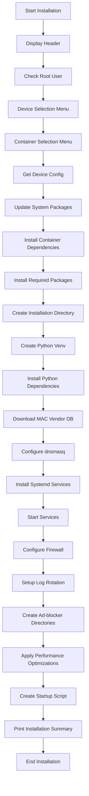

# PiDNS Installation Script Modification Plan

## 1. Current Installation Script Analysis

### Current Script Structure
The current `scripts/install.sh` has the following structure:
1. Configuration section
2. Color definitions for output
3. Basic device detection (Raspberry Pi only)
4. System package installation
5. Python environment setup
6. Configuration file installation
7. Service installation
8. Firewall configuration
9. Log rotation setup
10. Performance optimizations
11. Startup script creation
12. Installation summary

### Limitations of Current Script
- Limited device detection (only Raspberry Pi models)
- No container support options
- No interactive prompts for device selection
- Fixed configuration parameters
- No support for low-resource PCs

## 2. Enhanced Installation Script Design

### New Script Structure
```bash
#!/bin/bash
# Enhanced PiDNS Installation Script
# Supports multiple device types and container options

set -e  # Exit on any error

# Colors for output
RED='\033[0;31m'
GREEN='\033[0;32m'
YELLOW='\033[1;33m'
BLUE='\033[0;34m'
NC='\033[0m' # No Color

# Configuration
INSTALL_DIR="/home/pi/PiDNS"
SERVICE_USER="pi"
PYTHON_VENV="$INSTALL_DIR/venv"
DEVICE_TYPE=""
CONTAINER_TYPE=""

# Function to print colored output
print_status() {
    echo -e "${GREEN}[INFO]${NC} $1"
}

print_warning() {
    echo -e "${YELLOW}[WARNING]${NC} $1"
}

print_error() {
    echo -e "${RED}[ERROR]${NC} $1"
}

print_step() {
    echo -e "${BLUE}[STEP]${NC} $1"
}

# Function to display header
display_header() {
    clear
    echo "================================================"
    echo "      PiDNS Installation Script"
    echo "  Lightweight DNS and DHCP Server"
    echo "================================================"
    echo
}

# Function to check if running as root
check_root() {
    if [ "$EUID" -eq 0 ]; then
        print_error "This script should not be run as root. Run as pi user."
        exit 1
    fi
}

# Function to detect device automatically
detect_device() {
    print_status "Detecting device type..."
    
    # Check if running on Raspberry Pi
    if [ -f /proc/device-tree/model ]; then
        PI_MODEL=$(cat /proc/device-tree/model 2>/dev/null || echo "Unknown")
        
        # Extract specific Pi model
        if echo "$PI_MODEL" | grep -q "Raspberry Pi Zero 2 W"; then
            DEVICE_TYPE="pi-zero-2w"
            DEVICE_RAM="512MB"
            DEVICE_CPU="1-core"
        elif echo "$PI_MODEL" | grep -q "Raspberry Pi Zero"; then
            DEVICE_TYPE="pi-zero"
            DEVICE_RAM="512MB"
            DEVICE_CPU="1-core"
        elif echo "$PI_MODEL" | grep -q "Raspberry Pi 3"; then
            DEVICE_TYPE="pi-3"
            DEVICE_RAM="1GB"
            DEVICE_CPU="4-core"
        elif echo "$PI_MODEL" | grep -q "Raspberry Pi 4"; then
            DEVICE_TYPE="pi-4"
            DEVICE_RAM="2GB-8GB"
            DEVICE_CPU="4-core"
        elif echo "$PI_MODEL" | grep -q "Raspberry Pi 5"; then
            DEVICE_TYPE="pi-5"
            DEVICE_RAM="4GB-8GB"
            DEVICE_CPU="4-core"
        else
            DEVICE_TYPE="pi-unknown"
            DEVICE_RAM="unknown"
            DEVICE_CPU="unknown"
        fi
    else
        # Not a Raspberry Pi - check for low-resource PC
        TOTAL_RAM=$(free -m | awk '/Mem:/ {print $2}')
        CPU_CORES=$(nproc)
        
        if [ "$TOTAL_RAM" -le 1024 ] && [ "$CPU_CORES" -le 2 ]; then
            DEVICE_TYPE="low-resource-pc"
            DEVICE_RAM="${TOTAL_RAM}MB"
            DEVICE_CPU="${CPU_CORES}-core"
        else
            DEVICE_TYPE="standard-pc"
            DEVICE_RAM="${TOTAL_RAM}MB"
            DEVICE_CPU="${CPU_CORES}-core"
        fi
    fi
    
    print_status "Detected device: $DEVICE_TYPE with $DEVICE_RAM RAM and $DEVICE_CPU CPU"
}

# Function to prompt for device selection
prompt_device_selection() {
    echo "Please select your target device:"
    echo "1) Raspberry Pi Zero W"
    echo "2) Raspberry Pi Zero 2 W"
    echo "3) Raspberry Pi 3"
    echo "4) Raspberry Pi 4"
    echo "5) Raspberry Pi 5"
    echo "6) Low-resource PC (≤1GB RAM, ≤2 cores)"
    echo "7) Standard PC (>1GB RAM, >2 cores)"
    echo "8) Auto-detect (recommended)"
    echo
    
    while true; do
        read -p "Enter your choice (1-8): " device_choice
        
        case $device_choice in
            1)
                DEVICE_TYPE="pi-zero"
                break
                ;;
            2)
                DEVICE_TYPE="pi-zero-2w"
                break
                ;;
            3)
                DEVICE_TYPE="pi-3"
                break
                ;;
            4)
                DEVICE_TYPE="pi-4"
                break
                ;;
            5)
                DEVICE_TYPE="pi-5"
                break
                ;;
            6)
                DEVICE_TYPE="low-resource-pc"
                break
                ;;
            7)
                DEVICE_TYPE="standard-pc"
                break
                ;;
            8)
                detect_device
                break
                ;;
            *)
                print_error "Invalid choice. Please enter a number between 1 and 8."
                ;;
        esac
    done
    
    print_status "Selected device: $DEVICE_TYPE"
}

# Function to prompt for container selection
prompt_container_selection() {
    echo "Do you want to run PiDNS in a container? (y/n)"
    read -r container_response
    
    if [ "$container_response" = "y" ]; then
        echo "Please select container type:"
        echo "1) Docker"
        echo "2) Podman"
        echo "3) LXC"
        echo
        
        while true; do
            read -p "Enter your choice (1-3): " container_choice
            
            case $container_choice in
                1)
                    CONTAINER_TYPE="docker"
                    break
                    ;;
                2)
                    CONTAINER_TYPE="podman"
                    break
                    ;;
                3)
                    CONTAINER_TYPE="lxc"
                    break
                    ;;
                *)
                    print_error "Invalid choice. Please enter a number between 1 and 3."
                    ;;
            esac
        done
    else
        CONTAINER_TYPE="none"
    fi
    
    print_status "Selected container type: $CONTAINER_TYPE"
}

# Function to get device-specific configuration
get_device_config() {
    case $DEVICE_TYPE in
        "pi-zero"|"pi-zero-2w")
            CACHE_SIZE=100
            DNS_CACHE=100
            MAX_CONNECTIONS=50
            SWAPINESS=10
            REFRESH_INTERVAL=60
            MAX_DEVICES=50
            THREADS_PER_PAGE=1
            ;;
        "pi-3")
            CACHE_SIZE=200
            DNS_CACHE=200
            MAX_CONNECTIONS=100
            SWAPINESS=10
            REFRESH_INTERVAL=30
            MAX_DEVICES=100
            THREADS_PER_PAGE=2
            ;;
        "pi-4"|"pi-5")
            CACHE_SIZE=500
            DNS_CACHE=500
            MAX_CONNECTIONS=200
            SWAPINESS=5
            REFRESH_INTERVAL=15
            MAX_DEVICES=250
            THREADS_PER_PAGE=4
            ;;
        "low-resource-pc")
            CACHE_SIZE=300
            DNS_CACHE=300
            MAX_CONNECTIONS=150
            SWAPINESS=10
            REFRESH_INTERVAL=45
            MAX_DEVICES=75
            THREADS_PER_PAGE=2
            ;;
        "standard-pc")
            CACHE_SIZE=1000
            DNS_CACHE=1000
            MAX_CONNECTIONS=500
            SWAPINESS=1
            REFRESH_INTERVAL=10
            MAX_DEVICES=500
            THREADS_PER_PAGE=4
            ;;
        *)
            # Default/fallback configuration
            CACHE_SIZE=150
            DNS_CACHE=150
            MAX_CONNECTIONS=100
            SWAPINESS=10
            REFRESH_INTERVAL=30
            MAX_DEVICES=100
            THREADS_PER_PAGE=2
            ;;
    esac
}

# Function to update system packages
update_system_packages() {
    print_step "Updating system packages..."
    sudo apt-get update
    sudo apt-get upgrade -y
}

# Function to install container dependencies
install_container_dependencies() {
    case $CONTAINER_TYPE in
        "docker")
            print_step "Installing Docker..."
            if ! command -v docker &> /dev/null; then
                curl -fsSL https://get.docker.com -o get-docker.sh
                sh get-docker.sh
                sudo usermod -aG docker $USER
                print_warning "Please log out and log back in to use Docker without sudo."
            else
                print_status "Docker is already installed."
            fi
            ;;
        "podman")
            print_step "Installing Podman..."
            if ! command -v podman &> /dev/null; then
                sudo apt-get update
                sudo apt-get install -y podman podman-compose
            else
                print_status "Podman is already installed."
            fi
            ;;
        "lxc")
            print_step "Installing LXC..."
            if ! command -v lxc-create &> /dev/null; then
                sudo apt-get update
                sudo apt-get install -y lxc lxc-templates debootstrap
            else
                print_status "LXC is already installed."
            fi
            ;;
        *)
            print_step "Installing standard dependencies..."
            ;;
    esac
}

# Function to install required packages
install_required_packages() {
    print_step "Installing required packages..."
    
    if [ "$CONTAINER_TYPE" = "none" ]; then
        # Bare metal installation
        sudo apt-get install -y \
            dnsmasq \
            python3 \
            python3-pip \
            python3-venv \
            nginx \
            git \
            curl \
            wget
    else
        # Container installation - minimal packages
        sudo apt-get install -y \
            python3 \
            python3-pip \
            python3-venv \
            git \
            curl \
            wget
    fi
}

# Function to create installation directory
create_installation_directory() {
    print_step "Creating installation directory..."
    
    if [ ! -d "$INSTALL_DIR" ]; then
        mkdir -p "$INSTALL_DIR"
    fi
    
    cd "$INSTALL_DIR"
}

# Function to create Python virtual environment
create_python_venv() {
    print_step "Creating Python virtual environment..."
    python3 -m venv "$PYTHON_VENV"
    source "$PYTHON_VENV/bin/activate"
}

# Function to install Python dependencies
install_python_dependencies() {
    print_step "Installing Python dependencies..."
    pip install --upgrade pip
    pip install -r requirements.txt
    
    print_step "Installing ad-blocker dependencies..."
    pip install -r requirements_adblocker.txt
}

# Function to download MAC vendor database
download_mac_vendor_database() {
    print_step "Downloading MAC vendor database..."
    mkdir -p data
    curl -s "https://raw.githubusercontent.com/digitalocean/macvendorlookup/main/data/mac-vendors.json" -o data/mac-vendors.json
}

# Function to configure dnsmasq
configure_dnsmasq() {
    print_step "Configuring dnsmasq for $DEVICE_TYPE..."
    
    # Create temporary config with device-specific settings
    sed "s/CACHE_SIZE/$CACHE_SIZE/g; s/DNS_CACHE/$DNS_CACHE/g" config/dnsmasq.conf > /tmp/dnsmasq.conf
    
    # Install configuration
    sudo cp /tmp/dnsmasq.conf /etc/dnsmasq.conf
    sudo systemctl restart dnsmasq
    sudo systemctl enable dnsmasq
}

# Function to install systemd services
install_systemd_services() {
    print_step "Installing systemd services..."
    
    case $CONTAINER_TYPE in
        "docker")
            sudo cp services/pidns-docker.service /etc/systemd/system/
            ;;
        "podman")
            sudo cp services/pidns-podman.service /etc/systemd/system/
            ;;
        "lxc")
            sudo cp services/pidns-lxc.service /etc/systemd/system/
            ;;
        *)
            sudo cp services/pidns.service /etc/systemd/system/
            ;;
    esac
    
    sudo cp services/dnsmasq.service /etc/systemd/system/
    sudo cp services/adblocker.service /etc/systemd/system/
    
    # Reload systemd
    sudo systemctl daemon-reload
}

# Function to start services
start_services() {
    print_step "Starting PiDNS services..."
    
    case $CONTAINER_TYPE in
        "docker")
            sudo systemctl enable pidns-docker.service
            sudo systemctl start pidns-docker.service
            ;;
        "podman")
            sudo systemctl enable pidns-podman.service
            sudo systemctl start pidns-podman.service
            ;;
        "lxc")
            sudo systemctl enable pidns-lxc.service
            sudo systemctl start pidns-lxc.service
            ;;
        *)
            sudo systemctl enable pidns.service
            sudo systemctl start pidns.service
            ;;
    esac
    
    # Enable and start ad-blocker service
    sudo systemctl enable adblocker.service
    sudo systemctl start adblocker.service
}

# Function to configure firewall
configure_firewall() {
    if command -v ufw &> /dev/null; then
        print_step "Configuring firewall..."
        sudo ufw allow 8080/tcp
        sudo ufw allow 8081/tcp
        sudo ufw allow 53/udp
        sudo ufw allow 67/udp
    fi
}

# Function to set up log rotation
setup_log_rotation() {
    print_step "Setting up log rotation..."
    sudo tee /etc/logrotate.d/pidns > /dev/null << EOF
/var/log/pidns/*.log {
    weekly
    rotate 4
    compress
    delaycompress
    missingok
    notifempty
    create 644 $SERVICE_USER $SERVICE_USER
}
EOF

    # Create log directories
    sudo mkdir -p /var/log/pidns
    sudo chown $SERVICE_USER:$SERVICE_USER /var/log/pidns
    
    sudo mkdir -p /var/log/pidns-adblocker
    sudo chown $SERVICE_USER:$SERVICE_USER /var/log/pidns-adblocker
}

# Function to create ad-blocker data directories
create_adblocker_directories() {
    print_step "Creating ad-blocker data directories..."
    mkdir -p data/adblocker
    mkdir -p data/adblocker/blocklists
    mkdir -p logs/adblocker
}

# Function to apply performance optimizations
apply_performance_optimizations() {
    print_step "Applying performance optimizations..."
    
    # Increase socket buffer sizes
    echo 'net.core.rmem_max = 16777216' | sudo tee -a /etc/sysctl.conf
    echo 'net.core.wmem_max = 16777216' | sudo tee -a /etc/sysctl.conf
    
    # Configure swap usage based on device type
    echo "vm.swappiness = $SWAPINESS" | sudo tee -a /etc/sysctl.conf
    
    # Apply sysctl changes
    sudo sysctl -p
}

# Function to create startup script
create_startup_script() {
    print_step "Creating startup script..."
    cat > scripts/start.sh << EOF
#!/bin/bash

# PiDNS startup script

INSTALL_DIR="/home/pi/PiDNS"
PYTHON_VENV="$INSTALL_DIR/venv"

# Change to installation directory
cd "\$INSTALL_DIR"

# Activate virtual environment
source "\$PYTHON_VENV/bin/activate"

# Start the Flask application
exec python3 app/app.py
EOF

    chmod +x scripts/start.sh
}

# Function to print installation summary
print_installation_summary() {
    print_status "Installation completed successfully!"
    echo
    echo "PiDNS Configuration:"
    echo "- Device Type: $DEVICE_TYPE"
    echo "- Container Type: $CONTAINER_TYPE"
    echo "- Cache Size: $CACHE_SIZE"
    echo "- DNS Cache: $DNS_CACHE"
    echo "- Max Connections: $MAX_CONNECTIONS"
    echo "- Refresh Interval: $REFRESH_INTERVAL seconds"
    echo "- Max Devices: $MAX_DEVICES"
    echo
    echo "PiDNS Dashboard Information:"
    echo "- Main Dashboard URL: http://$(hostname -I | awk '{print $1}'):8080"
    echo "- Ad-Blocker Dashboard URL: http://$(hostname -I | awk '{print $1}'):8081"
    echo "- Default username: admin"
    echo "- Default password: password"
    echo
    echo "Ad-Blocker Features:"
    echo "- Manage block lists with predefined categories"
    echo "- Custom whitelist and blacklist with categories and expiration"
    echo "- Real-time statistics and query logging"
    echo "- Block ads, tracking, malware, and more"
    echo
    echo "Important:"
    echo "1. Change the default password by setting PIDNS_PASSWORD environment variable"
    echo "2. Access the ad-blocker dashboard at http://$(hostname -I | awk '{print $1}'):8081"
    echo "3. Configure block lists in the ad-blocker dashboard"
    echo "4. Configure your router to use this Pi as DNS server (IP: $(hostname -I | awk '{print $1}'))"
    echo "5. Configure your router to use this Pi as DHCP server if needed"
    echo
    print_warning "Please reboot your system to ensure all services start correctly."
}

# Main installation function
main() {
    # Display header
    display_header
    
    # Check if running as root
    check_root
    
    # Prompt for device selection
    prompt_device_selection
    
    # Prompt for container selection
    prompt_container_selection
    
    # Get device-specific configuration
    get_device_config
    
    # Update system packages
    update_system_packages
    
    # Install container dependencies
    install_container_dependencies
    
    # Install required packages
    install_required_packages
    
    # Create installation directory
    create_installation_directory
    
    # Create Python virtual environment
    create_python_venv
    
    # Install Python dependencies
    install_python_dependencies
    
    # Download MAC vendor database
    download_mac_vendor_database
    
    # Configure dnsmasq
    configure_dnsmasq
    
    # Install systemd services
    install_systemd_services
    
    # Start services
    start_services
    
    # Configure firewall
    configure_firewall
    
    # Set up log rotation
    setup_log_rotation
    
    # Create ad-blocker data directories
    create_adblocker_directories
    
    # Apply performance optimizations
    apply_performance_optimizations
    
    # Create startup script
    create_startup_script
    
    # Print installation summary
    print_installation_summary
}

# Run main function
main "$@"
```

## 3. Interactive Menu Design

### Main Menu Flow


### Device Selection Menu
```
================================================
      PiDNS Installation Script
  Lightweight DNS and DHCP Server
================================================

Please select your target device:
1) Raspberry Pi Zero W
2) Raspberry Pi Zero 2 W
3) Raspberry Pi 3
4) Raspberry Pi 4
5) Raspberry Pi 5
6) Low-resource PC (≤1GB RAM, ≤2 cores)
7) Standard PC (>1GB RAM, >2 cores)
8) Auto-detect (recommended)

Enter your choice (1-8): 
```

### Container Selection Menu
```
Do you want to run PiDNS in a container? (y/n) y
Please select container type:
1) Docker
2) Podman
3) LXC

Enter your choice (1-3): 
```

## 4. Error Handling and Validation

### Input Validation
```bash
# Function to validate device selection
validate_device_selection() {
    case $1 in
        1|2|3|4|5|6|7|8)
            return 0  # Valid
            ;;
        *)
            return 1  # Invalid
            ;;
    esac
}

# Function to validate container selection
validate_container_selection() {
    case $1 in
        1|2|3)
            return 0  # Valid
            ;;
        *)
            return 1  # Invalid
            ;;
    esac
}
```

### Error Recovery
```bash
# Function to handle installation errors
handle_error() {
    local exit_code=$?
    local line_number=$1
    print_error "Installation failed at line $line_number with exit code $exit_code"
    print_error "Please check the error messages above and try again."
    
    # Offer to clean up partial installation
    echo
    read -p "Do you want to clean up the partial installation? (y/n): " cleanup_choice
    if [ "$cleanup_choice" = "y" ]; then
        cleanup_installation
    fi
    
    exit $exit_code
}

# Function to clean up partial installation
cleanup_installation() {
    print_status "Cleaning up partial installation..."
    
    # Stop and disable services
    sudo systemctl stop pidns.service 2>/dev/null || true
    sudo systemctl disable pidns.service 2>/dev/null || true
    sudo systemctl stop adblocker.service 2>/dev/null || true
    sudo systemctl disable adblocker.service 2>/dev/null || true
    
    # Remove service files
    sudo rm -f /etc/systemd/system/pidns.service
    sudo rm -f /etc/systemd/system/adblocker.service
    sudo systemctl daemon-reload
    
    # Remove configuration files
    sudo rm -f /etc/dnsmasq.conf
    sudo systemctl restart dnsmasq 2>/dev/null || true
    
    # Remove installation directory
    if [ -d "$INSTALL_DIR" ]; then
        rm -rf "$INSTALL_DIR"
    fi
    
    print_status "Cleanup completed."
}
```

### Progress Tracking
```bash
# Function to display progress
display_progress() {
    local current_step=$1
    local total_steps=$2
    local step_name=$3
    
    local progress=$((current_step * 100 / total_steps))
    local completed=$(printf "%3d" $progress)
    
    echo -ne "\r[${completed}%] $step_name"
    
    if [ $current_step -eq $total_steps ]; then
        echo  # New line when complete
    fi
}

# Example usage in main function
TOTAL_STEPS=15
CURRENT_STEP=0

display_progress $((++CURRENT_STEP)) $TOTAL_STEPS "Displaying header"
display_progress $((++CURRENT_STEP)) $TOTAL_STEPS "Checking root user"
display_progress $((++CURRENT_STEP)) $TOTAL_STEPS "Prompting for device selection"
# ... and so on
```

## 5. Silent Installation Mode

### Command Line Arguments
```bash
# Function to parse command line arguments
parse_arguments() {
    while [[ $# -gt 0 ]]; do
        case $1 in
            --device)
                DEVICE_TYPE="$2"
                shift 2
                ;;
            --container)
                CONTAINER_TYPE="$2"
                shift 2
                ;;
            --silent)
                SILENT_MODE=true
                shift
                ;;
            --help)
                display_help
                exit 0
                ;;
            *)
                print_error "Unknown option: $1"
                display_help
                exit 1
                ;;
        esac
    done
}

# Function to display help
display_help() {
    echo "PiDNS Installation Script"
    echo
    echo "Usage: $0 [OPTIONS]"
    echo
    echo "Options:"
    echo "  --device DEVICE_TYPE      Specify device type (pi-zero, pi-zero-2w, pi-3, pi-4, pi-5, low-resource-pc, standard-pc)"
    echo "  --container CONTAINER_TYPE Specify container type (docker, podman, lxc, none)"
    echo "  --silent                  Run in silent mode with no interactive prompts"
    echo "  --help                    Display this help message"
    echo
    echo "Examples:"
    echo "  $0 --device pi-4 --container docker"
    echo "  $0 --device standard-pc --container none --silent"
    echo
}

# Modified main function to support silent mode
main() {
    # Parse command line arguments
    parse_arguments "$@"
    
    # Display header (unless in silent mode)
    if [ "$SILENT_MODE" != "true" ]; then
        display_header
    fi
    
    # Check if running as root
    check_root
    
    # Get device selection (from command line or prompt)
    if [ -z "$DEVICE_TYPE" ]; then
        prompt_device_selection
    else
        print_status "Using specified device type: $DEVICE_TYPE"
    fi
    
    # Get container selection (from command line or prompt)
    if [ -z "$CONTAINER_TYPE" ]; then
        prompt_container_selection
    else
        print_status "Using specified container type: $CONTAINER_TYPE"
    fi
    
    # Rest of the installation process...
}
```

## 6. Installation Logging

### Logging Function
```bash
# Function to initialize logging
init_logging() {
    LOG_FILE="$INSTALL_DIR/installation.log"
    mkdir -p "$(dirname "$LOG_FILE")"
    echo "PiDNS Installation Log - $(date)" > "$LOG_FILE"
    echo "========================================" >> "$LOG_FILE"
}

# Function to log message
log_message() {
    local level=$1
    local message=$2
    local timestamp=$(date "+%Y-%m-%d %H:%M:%S")
    
    echo "[$timestamp] [$level] $message" >> "$LOG_FILE"
    
    # Also print to console unless in silent mode
    if [ "$SILENT_MODE" != "true" ]; then
        case $level in
            "INFO")
                print_status "$message"
                ;;
            "WARNING")
                print_warning "$message"
                ;;
            "ERROR")
                print_error "$message"
                ;;
            "STEP")
                print_step "$message"
                ;;
        esac
    fi
}

# Example usage in installation functions
update_system_packages() {
    log_message "STEP" "Updating system packages..."
    sudo apt-get update >> "$LOG_FILE" 2>&1
    sudo apt-get upgrade -y >> "$LOG_FILE" 2>&1
    
    if [ $? -eq 0 ]; then
        log_message "INFO" "System packages updated successfully"
    else
        log_message "ERROR" "Failed to update system packages"
        return 1
    fi
}
```

## 7. Installation Verification

### Verification Function
```bash
# Function to verify installation
verify_installation() {
    log_message "STEP" "Verifying installation..."
    
    local verification_passed=true
    
    # Check if services are running
    if ! systemctl is-active --quiet pidns.service; then
        log_message "ERROR" "PiDNS service is not running"
        verification_passed=false
    else
        log_message "INFO" "PiDNS service is running"
    fi
    
    if ! systemctl is-active --quiet adblocker.service; then
        log_message "ERROR" "Ad-blocker service is not running"
        verification_passed=false
    else
        log_message "INFO" "Ad-blocker service is running"
    fi
    
    # Check if dnsmasq is running
    if ! systemctl is-active --quiet dnsmasq; then
        log_message "ERROR" "dnsmasq service is not running"
        verification_passed=false
    else
        log_message "INFO" "dnsmasq service is running"
    fi
    
    # Check if dashboard is accessible
    if ! curl -s -f http://localhost:8080/api/health > /dev/null; then
        log_message "ERROR" "Main dashboard is not accessible"
        verification_passed=false
    else
        log_message "INFO" "Main dashboard is accessible"
    fi
    
    if ! curl -s -f http://localhost:8081/api/health > /dev/null; then
        log_message "ERROR" "Ad-blocker dashboard is not accessible"
        verification_passed=false
    else
        log_message "INFO" "Ad-blocker dashboard is accessible"
    fi
    
    # Check if configuration files exist
    if [ ! -f "/etc/dnsmasq.conf" ]; then
        log_message "ERROR" "dnsmasq configuration file does not exist"
        verification_passed=false
    else
        log_message "INFO" "dnsmasq configuration file exists"
    fi
    
    if [ ! -f "$INSTALL_DIR/config/flask_config.py" ]; then
        log_message "ERROR" "Flask configuration file does not exist"
        verification_passed=false
    else
        log_message "INFO" "Flask configuration file exists"
    fi
    
    # Print verification result
    if [ "$verification_passed" = true ]; then
        log_message "INFO" "Installation verification passed"
        return 0
    else
        log_message "ERROR" "Installation verification failed"
        return 1
    fi
}
```

## 8. Rollback Functionality

### Rollback Function
```bash
# Function to create installation snapshot
create_installation_snapshot() {
    log_message "STEP" "Creating installation snapshot..."
    
    SNAPSHOT_DIR="$INSTALL_DIR/snapshot-$(date +%Y%m%d-%H%M%S)"
    mkdir -p "$SNAPSHOT_DIR"
    
    # Save current configuration files
    if [ -f "/etc/dnsmasq.conf" ]; then
        sudo cp /etc/dnsmasq.conf "$SNAPSHOT_DIR/"
    fi
    
    if [ -f "/etc/systemd/system/pidns.service" ]; then
        sudo cp /etc/systemd/system/pidns.service "$SNAPSHOT_DIR/"
    fi
    
    if [ -f "/etc/systemd/system/adblocker.service" ]; then
        sudo cp /etc/systemd/system/adblocker.service "$SNAPSHOT_DIR/"
    fi
    
    # Save package list
    dpkg --get-selections > "$SNAPSHOT_DIR/package-list.txt"
    
    # Save service status
    systemctl list-unit-files > "$SNAPSHOT_DIR/service-status.txt"
    
    log_message "INFO" "Installation snapshot created at $SNAPSHOT_DIR"
    echo "$SNAPSHOT_DIR" > "$INSTALL_DIR/latest-snapshot.txt"
}

# Function to rollback installation
rollback_installation() {
    if [ ! -f "$INSTALL_DIR/latest-snapshot.txt" ]; then
        log_message "ERROR" "No installation snapshot found"
        return 1
    fi
    
    SNAPSHOT_DIR=$(cat "$INSTALL_DIR/latest-snapshot.txt")
    
    if [ ! -d "$SNAPSHOT_DIR" ]; then
        log_message "ERROR" "Installation snapshot directory not found: $SNAPSHOT_DIR"
        return 1
    fi
    
    log_message "STEP" "Rolling back installation from snapshot: $SNAPSHOT_DIR"
    
    # Stop services
    sudo systemctl stop pidns.service 2>/dev/null || true
    sudo systemctl stop adblocker.service 2>/dev/null || true
    sudo systemctl stop dnsmasq 2>/dev/null || true
    
    # Restore configuration files
    if [ -f "$SNAPSHOT_DIR/dnsmasq.conf" ]; then
        sudo cp "$SNAPSHOT_DIR/dnsmasq.conf" /etc/dnsmasq.conf
    log_message "INFO" "Restored dnsmasq configuration"
    fi
    
    if [ -f "$SNAPSHOT_DIR/pidns.service" ]; then
        sudo cp "$SNAPSHOT_DIR/pidns.service" /etc/systemd/system/
        sudo systemctl daemon-reload
        log_message "INFO" "Restored PiDNS service file"
    fi
    
    if [ -f "$SNAPSHOT_DIR/adblocker.service" ]; then
        sudo cp "$SNAPSHOT_DIR/adblocker.service" /etc/systemd/system/
        sudo systemctl daemon-reload
        log_message "INFO" "Restored ad-blocker service file"
    fi
    
    # Start services
    sudo systemctl start dnsmasq
    sudo systemctl start pidns.service
    sudo systemctl start adblocker.service
    
    log_message "INFO" "Installation rollback completed"
    return 0
}
```

## 9. Testing the Modified Installation Script

### Test Plan
1. **Unit Testing**: Test individual functions in isolation
2. **Integration Testing**: Test the entire installation process
3. **Device Testing**: Test on all supported device types
4. **Container Testing**: Test with all container options
5. **Error Handling Testing**: Test error scenarios and recovery
6. **Silent Mode Testing**: Test silent installation with command line arguments

### Test Cases
```bash
# Test case for device detection
test_device_detection() {
    echo "Testing device detection..."
    
    # Mock different device types
    for device in "pi-zero" "pi-zero-2w" "pi-3" "pi-4" "pi-5" "low-resource-pc" "standard-pc"; do
        echo "Testing device: $device"
        DEVICE_TYPE=$device
        get_device_config
        
        # Verify configuration parameters are set correctly
        case $device in
            "pi-zero"|"pi-zero-2w")
                if [ "$CACHE_SIZE" -ne 100 ]; then
                    echo "FAIL: Incorrect cache size for $device"
                    return 1
                fi
                ;;
            # Add more test cases for other device types
        esac
    done
    
    echo "PASS: Device detection tests"
    return 0
}

# Test case for container installation
test_container_installation() {
    echo "Testing container installation..."
    
    # Test each container type
    for container in "docker" "podman" "lxc" "none"; do
        echo "Testing container: $container"
        CONTAINER_TYPE=$container
        
        # Mock installation steps
        install_container_dependencies
        
        # Verify container-specific steps are executed
        case $container in
            "docker")
                if ! command -v docker &> /dev/null; then
                    echo "FAIL: Docker not installed"
                    return 1
                fi
                ;;
            # Add more test cases for other container types
        esac
    done
    
    echo "PASS: Container installation tests"
    return 0
}
```

## 10. Implementation Steps

1. Create enhanced installation script with interactive prompts
2. Add device detection and selection functionality
3. Add container selection functionality
4. Implement device-specific configuration parameters
5. Add container-specific installation paths
6. Implement error handling and validation
7. Add silent installation mode with command line arguments
8. Implement installation logging
9. Add installation verification functionality
10. Implement rollback functionality
11. Create comprehensive test plan
12. Test the modified installation script on all supported device types and container options
13. Update documentation with new installation options
14. Final review and validation