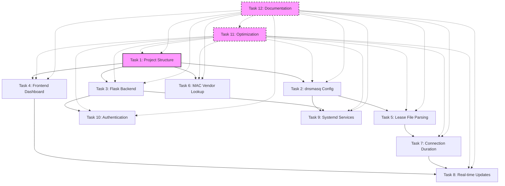

# PiDNS Task Dependencies

## Task Dependency Diagram

## Critical Path

The critical path for this project is:

1. **Task 1: Project Structure** (1 hour)
   - Foundation for all other tasks

2. **Task 2: dnsmasq Config** (2 hours)
   - Required for lease file parsing

3. **Task 5: Lease File Parsing** (2 hours)
   - Required for connection duration calculation

4. **Task 7: Connection Duration** (1.5 hours)
   - Required for real-time updates

5. **Task 8: Real-time Updates** (2 hours)
   - Finalizes dashboard functionality

**Total Critical Path Time: 8.5 hours**

## Parallel Tasks

Several tasks can be worked on in parallel after Task 1 is complete:

### Group 1: Backend Services (Can be done in parallel)
- **Task 2: dnsmasq Config** (2 hours)
- **Task 3: Flask Backend** (3 hours)
- **Task 6: MAC Vendor Lookup** (2 hours)

### Group 2: Frontend Development (Can be done in parallel)
- **Task 4: Frontend Dashboard** (4 hours)

### Group 3: System Integration (Depends on previous groups)
- **Task 9: Systemd Services** (1.5 hours)
- **Task 10: Authentication** (2 hours)

### Group 4: Ongoing Tasks
- **Task 11: Optimization** (2 hours, ongoing throughout project)
- **Task 12: Documentation** (2 hours, ongoing throughout project)

## Recommended Implementation Order

### Phase 1: Foundation (4 hours)
1. **Task 1: Project Structure** (1 hour)
2. **Task 2: dnsmasq Config** (2 hours)
3. **Task 3: Flask Backend** (3 hours, can start after Task 1)

### Phase 2: Core Functionality (6 hours)
1. **Task 5: Lease File Parsing** (2 hours, after Task 2)
2. **Task 6: MAC Vendor Lookup** (2 hours, can be done in parallel)
3. **Task 7: Connection Duration** (1.5 hours, after Task 5)
4. **Task 4: Frontend Dashboard** (4 hours, can start after Task 1)

### Phase 3: Integration and Polish (5.5 hours)
1. **Task 8: Real-time Updates** (2 hours, after Tasks 4 and 7)
2. **Task 10: Authentication** (2 hours, after Task 3)
3. **Task 9: Systemd Services** (1.5 hours, after Tasks 2 and 3)

### Phase 4: Finalization (4 hours)
1. **Task 11: Optimization** (2 hours, ongoing)
2. **Task 12: Documentation** (2 hours, ongoing)

## Risk Assessment

### High Risk Tasks
- **Task 2: dnsmasq Config** - Network configuration can be tricky
- **Task 9: Systemd Services** - Service configuration can have system-wide impact

### Medium Risk Tasks
- **Task 5: Lease File Parsing** - File format may vary between dnsmasq versions
- **Task 8: Real-time Updates** - May require optimization for Pi's limited resources

### Low Risk Tasks
- **Task 1: Project Structure** - Straightforward directory setup
- **Task 4: Frontend Dashboard** - Standard web development
- **Task 12: Documentation** - Documentation work

## Mitigation Strategies

### For High Risk Tasks
- Test dnsmasq configuration in a virtual environment first
- Create backup of system configuration before applying changes
- Implement rollback procedures

### For Medium Risk Tasks
- Add extensive error handling
- Implement logging for debugging
- Create fallback mechanisms

### For Low Risk Tasks
- Follow best practices
- Use version control for tracking changes
- Regular testing during development